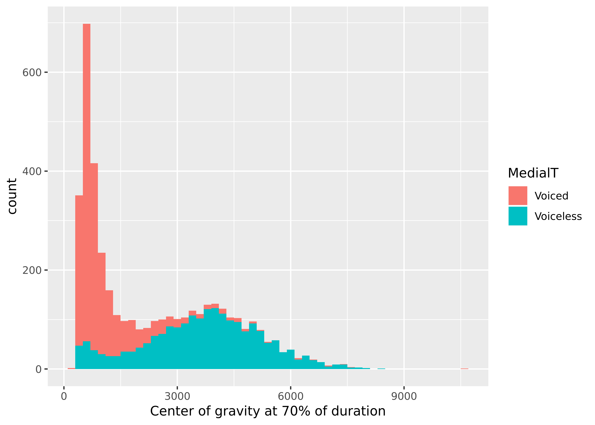

> Note: An html version of this document, which includes the evaluated result of all code chunks, can be found at https://nzilbb.github.io/How-to-Train-Your-Classifier/How_to_Train_Your_Classifier.html.

```{r setup, include=FALSE}
knitr::opts_chunk$set(echo = TRUE, comment = "", dpi=600, warning=FALSE)

library(tidyverse)
library(magrittr)
library(ranger)
library(caret)
library(knitr)
library(DMwR)
library(parallel)
library(foreach)
library(doParallel)
```


```{css, echo=FALSE}
pre.r.inlineData, pre.r.figure {
  display: none;
}

pre.r.displayCode {
  display: block;
}

pre.fileRemove {
  display: none;
}

blockquote {
  display: none;
}
```

# Introduction

This guide walks readers through the process of training a random-forest classifier for automated coding of sociophonetic variation, using the statistical computing language R [@RCoreTeam2018] and the packages `ranger` [@WrightZiegler2017] and `caret` [@Kuhn2018]. This guide is intended to be a companion to our [2020 _Laboratory Phonology_ article](https://www.journal-labphon.org/articles/10.5334/labphon.216/) "From categories to gradience: Auto-coding sociophonetic variation with random forests", and it recreates the classifier of Southland English non-prevocalic /r/ discussed in the article. By consulting [the R Markdown file that generated this document](https://github.com/nzilbb/How-to-Train-Your-Classifier/blob/main/How_to_Train_Your_Classifier.Rmd), readers can run the code on their own systems to recreate the /r/ classifier. The classifier file can also be found [here](https://github.com/nzilbb/How-to-Train-Your-Classifier/blob/main/LabPhonClassifier.Rds).

> IMPORTANT: While you can run all this code, we don't recommend trying to run it all at once (e.g., by 'knitting' the R Markdown document); the code that generated this document was tailored to a machine with 32 processors and still takes several hours to run start-to-finish. As we mention below, training a classifier is not a one-size-fits-all process.

This guide goes through the following steps:

1. Pre-process data

2. Determine classifier performance measure

3. Train an initial classifier

4. Tune hyperparameters

5. Determine effect of outliers

6. Train final classifier

7. Auto-code new tokens and extract classifier probabilities for hand-coded tokens

Perhaps the most important thing to know is that **training a classifier is not a one-size-fits-all process**. Your decisions about how to go about training a classifier will change depending on your data, your variables, your research questions, your standards for what counts as adequate performance, etc. This guide describes the process for one *particular* set of data, a *particular* variable, *particular* research questions, etc., and shouldn't be taken as an exact template for every possible case.

# Implementation notes

This guide is intended to be accessible to intermediate to advanced R users. Some of the coding techniques used in this guide are fairly advanced, but you won't need to understand all the code to use this guide or to train your own classifiers.

> This guide also includes text that's visible only on the R Markdown version of the document (to avoid cluttering the html version) giving more detail about the implementation of the code. Like this paragraph, R Markdown-only text in this document begins with a 'greater than' sign.

The steps in this guide can be used by any computer that can run R. That said, progressing through all of the steps listed here can be very time-consuming, especially with large amounts of data. As a result, all of the forests in this guide were generated on a computing cluster running Ubuntu 16.04 with 32 virtual cores and 64 GB of memory, in order to leverage R's support for parallel computing. (Despite this powerful hardware, the code in this guide takes over 4 hours to run in terms of pure running time.) The code used here for running models in parallel (which uses the package `doParallel`) should work on all systems, although the user will need to adjust the number of cores to their system (you can find out how many cores are available via the `detectCores()` function in the `parallel` package). Note that `train()` (the function we use to train classifiers in this guide) by default uses a parallel backend when one is available (e.g., to train multiple resamples at a time), so parallelization is used even in instances where the end-user doesn't explicitly invoke it using `doParallel` methods.

Since random forests are a stochastic process, results can be slightly different with each run, so this guide uses random seeds to ensure reproducibility. In single forest runs, it suffices to use `set.seed()` prior to running `train()`. In situations where `doParallel` methods are used to run a list of forests differing by a hyperparameter, it's necessary to use `clusterSetRNGStream()` after registering the cluster and before calling `foreach()`; this ensures that each core starts with the same random seed. Finally, in Step 5 when we want to run lists of non-identical forests that don't differ by any parameters, we use the `seeds` argument of `trainControl()`.

Finally, our code creates 'dummy files', with no extension or contents, in a `Model Status` subfolder to help us keep track of when the sub-models finish running. This technique is especially useful when you expect some sub-models to take longer than others (e.g., repeated *k*-fold cross-validation will naturally take longer than non-repeated *k*-fold cross-validation). Although we're only saving 'dummy files' here, you can also save more useful files; for example, if the overall model is too big to store in memory and the model crashes before all sub-models are complete, you can replace the second 'dummy file' with a command to save each sub-model when it's finished running or a summary of the sub-model.

```{r, class.output="displayCode"}
if (!dir.exists("Model Status")) dir.create("Model Status")
```


# Step 0: Get hand-coded data and load required packages

To run the code in this guide, you'll need [R](https://cran.r-project.org/) and several R packages. In particular, this code relies heavily on the collection of packages called the [tidyverse](https://www.tidyverse.org/), which make R code faster, more readable, and safer. Though you can run this code without it, we recommend the [RStudio](https://www.rstudio.com/) integrated development environment for ease of understanding code. Information on the system, R version, and package versions that generated this guide can be found at the [end of this guide](#Train-SessionInfo). 

Install necessary packages:

```{r, class.source="displayCode"}
##From https://stackoverflow.com/a/9341833/5432121
pkgTest <- function(x) {
  if (!require(x, character.only=TRUE)) {
    install.packages(x)
    if (!require(x, character.only=TRUE)) stop(paste("Package", x, "not found"))
  }
}

pkgTest("tidyverse")
pkgTest("magrittr")
pkgTest("DMwR")
pkgTest("diptest")
pkgTest("parallel")
pkgTest("foreach")
pkgTest("doParallel")
pkgTest("caret")
pkgTest("ranger")
```

As a prerequisite to the steps we describe in this guide, you'll also need data that has been hand-coded into two or more variants and for which you have all the acoustic measures you'll want to enter into the classifier. In the case of our /r/ classifier (for which we provide the data as an example), we had several thousand hand-coded tokens, for which we extracted 180 acoustic measures using the "Process with Praat" function in LaBB-CAT [@FromontHay2012]; these measures were motivated by previous literature on the acoustic correlates of rhoticity in English and other languages [e.g., @LawsonStuartSmithScobbie2018; @Heselwood2009]. More details on the choice of these measures can be found in the main text.

Load the /r/ data, which includes 40614 rows and 217 columns, the last 180 of which are acoustic measures to be fed into the classifier.

> The first 37 columns contain mostly linguistic information, plus LaBB-CAT metadata (TokenNum and MatchId) and speaker data (Speaker, which has been anonymized, and Gender). To preserve anonymity, both Speaker and Word have been anonymized to dummy factors. Stress is coded as either ' (primary word stress), " (secondary word stress), or 0 (unstressed). Syllable and columns ending in "DISC" are phonemic strings represented in the DISC phonetic alphabet used by CELEX (see https://catalog.ldc.upenn.edu/docs/LDC96L14/eug_let.pdf); FollSegmentNoPause and FollSegment are represented in the ARPAbet codes used by the CMU pronouncing dictionary, without stress markers on vowels (see http://www.speech.cs.cmu.edu/cgi-bin/cmudict); and Vowel is represented in Wells lexical sets as they relate to New Zealand English (see https://www.phon.ucl.ac.uk/home/wells/stanlexsets.htm). HowCoded is used to separate tokens that have already been hand-coded from those to be auto-coded (which therefore have NA for Rpresent). All other columns should be self-explanatory.


```{r, class.output="displayCode"}
trainingData <- readRDS("Data/RClassifierData_03July2019.Rds")
trainingData %>% dim()
trainingData %>% colnames()
```


# Step 1: Pre-process data: Normalization, missing value imputation, outlier marking

Due to a fair amount of measurement error in automatically extracting formant and pitch measurements, and to account for the degree to which formant frequencies are impacted by vocal tract length, we subjected /r/ measurements to pre-processing before entering data into the classifier. Your data might not need all these steps---we didn't need to do nearly as much pre-processing for the medial /t/ data---but we'll walk through them for your reference.

First, we removed tokens that either had bad durations or immediately preceded another /r/. Checking durations is a way to filter out tokens whose forced alignment is bad, since individual /r/ tokens are unlikely to be long (except perhaps in word lists or utterance-finally). We randomly sampled tokens in a variety of duration bands (e.g., [500 ms, 550 ms)) to check for misalignment; this procedure led to a ceiling of 450 ms. A handful of tokens somehow had zero or negative durations, so we removed these tokens, as well.

```{r, class.output="displayCode"}
trainingData <-
  trainingData %>% 
  filter(TokenDur > 0, TokenDur < 0.45, FollSegment!="R")
```

Second, we normalized F1--F4 measurements (timepoint measurements and maxima/minima) by subtracting the speaker's mean word-initial /r/ midpoint measurement for that formant from the raw measurement. As with vowels, formant measurements for rhotics are affected by vocal tract length, but whereas normalization methods abound for vowel formant frequencies, there is no generally accepted way to normalize formants in rhotics. Our method of using each speaker's initial /r/ formants as a baseline measure accounts for vocal tract length, following Hay and Clendon's [-@HayClendon2012] approach of modeling rhoticity by comparing non-prevocalic /r/ F3 against initial /r/ F3.

```{r, class.output="displayCode"}
trainingData <-
  trainingData %>% 
  mutate_at(vars(matches("^F1(_[2-8][50]|min|max)$")), ~ . - Initial_F1_50) %>% 
  mutate_at(vars(matches("^F2(_[2-8][50]|min|max)$")), ~ . - Initial_F2_50) %>% 
  mutate_at(vars(matches("^F3(_[2-8][50]|min|max)$")), ~ . - Initial_F3_50) %>% 
  mutate_at(vars(matches("^F4(_[2-8][50]|min|max)$")), ~ . - Initial_F4_50)
```

Third, we centered and scaled token duration by speaker and vowel; in cases where token duration was invariant within a speaker $\times$ vowel distribution, we used a value of 0. 

```{r, class.output="displayCode"}
trainingData <-
  trainingData %>% 
  group_by(Speaker, Vowel) %>% 
  mutate(TokenDurSD = sd(TokenDur, na.rm=TRUE) %>% replace_na(0),
         TokenDur = if_else(TokenDurSD > 0, scale(TokenDur), 0)) %>% 
  select(-TokenDurSD) %>% 
  ungroup()
```

Fourth, to deal with tokens that had missing pitch and/or F4 measurements (including F4 bandwidth), we imputed missing F0 and F4 measurements using *k* Nearest Neighbor imputation (with *k* = 10) via the function `knnImputation()` in the package `DMwR` [@Torgo2010]. Since random forests cannot classify observations with missing measurements, the imputation of missing measurements is common practice in machine learning contexts [e.g., @BreenEtAl2019; @HudakEtAl2008]. At the same time, this step won't necessarily apply to every data set (we didn't need to impute any measurements for the medial /t/ data). Note that this next step can be fairly time-consuming (on the cluster, it takes around 15 minutes).

> For time-consuming steps such as imputation, we use caching to save time by avoiding re-running code. If we give the chunk a unique name and set `cache=TRUE`, R Markdown will save the results of the code chunk to a cache when initially knitting the file, such that on subsequent knits the results will simply be re-loaded. This can save a considerable amount of time, especially if you want to tweak text that's outside of the cached chunks or plots that use data generated by cached chunks, etc. More info on caching can be found at https://yihui.name/knitr/demo/cache/ and in the `knitr` manual at https://yihui.name/knitr/demo/manual/.

```{r imputation, class.output="displayCode", cache=TRUE}
##Capture current column ordering
origCols <- trainingData %>% colnames()

##Set up dataframe for imputation: Must contain only the measures to be imputed 
##  and the measures being used to calculate k nearest neighbors.
imputeDF <-
  trainingData %>%
  ##In this data, MatchId serves as a unique identifier for tokens
  select(MatchId, TokenDur:absSlopeF0) %>% 
  select(-contains("F0"), -contains("F4"), -contains("BW4")) %>%
  select_if(~ sum(is.na(.)) < 300) %>% 
  filter(complete.cases(.)) %>% 
  left_join(trainingData %>% 
              select(MatchId, TokenDur:absSlopeF0) %>% 
              select(MatchId, contains("F0"), contains("F4"), contains("BW4")),
            by="MatchId")

##Perform imputation--this takes a while!
imputeDF <- 
  imputeDF %>% 
  select(-MatchId) %>% 
  as.data.frame() %>% 
  knnImputation() %>% 
  cbind(imputeDF %>% select(MatchId))

##Add imputed values back into data frame (MatchId is a unique identifier, so
##  we can use it to match tokens between data frames)
trainingData <-
  trainingData %>% 
  left_join(imputeDF %>% 
              select(MatchId, contains("F0"), contains("F4"), contains("BW4")), 
            by="MatchId") %>% 
  select(-ends_with(".x")) %>% 
  rename_at(vars(ends_with(".y")), str_remove, ".y") %>% 
  select(!!origCols) 

##Clean up
rm(imputeDF)
```

Fifth, we marked numerous measures for potential outlier-hood: formant timepoint measures, formant minima/maxima, pitch timepoint measures, pitch minima/maxima, intensity measures, and duration. Potential outliers were measurements that were more than 1.5 $\times$ the interquartile range (third quartile minus first quartile) outside the first or third quartile for that measure's distribution by speaker and by vowel. We won't actually *exclude* outliers now; instead, we'll use outlier data in Step 5 below to figure out which outliers we can afford to keep, and which ones we're better off discarding. As with imputation, outlier-marking isn't necessary or appropriate for all situations; we give more details in the subsection following this one.


```{r markOutliers, class.output="displayCode", cache=TRUE}
trainingData <-
  trainingData %>%
  group_by(Speaker, Vowel) %>% 
  mutate_at(vars(matches("^F[01234](_[2-8][50]|min|max)$"), starts_with("intens_"), TokenDur), 
            list(Outlier = ~ . < quantile(., 0.25, na.rm=TRUE) - 1.5*IQR(., na.rm=TRUE) |
                   . > 1.5*IQR(., na.rm=TRUE) + quantile(., 0.75, na.rm=TRUE))) %>% 
  ungroup()
```

Finally, we excluded tokens that had missing measurements for measures other than F0 and F4.

```{r, class.output="displayCode"}
trainingData <-
  trainingData %>% 
  filter_at(vars(TokenDur:absSlopeF0), all_vars(!is.na(.))) %>% 
  droplevels()
```

Let's save our progress by writing the training data to an RDS file.

```{r, class.output="displayCode"}
if (!dir.exists("Data")) dir.create("Data")
trainingData %>% saveRDS("Data/trainingData.Rds")
trainingData <- readRDS("Data/trainingData.Rds")
```


## Do we even need to mark outliers?

Measurement error is a fact of life when using corpus methods, and of course classifiers will perform better if they have cleaner data. At the same time, not all data is appropriate for outlier-marking. Here are the conditions under which outlier-marking is appropriate:

1. Some measures include measurement error. If your data is spotless, then any outliers are 'true' outliers, not just mis-measurements, and your model will be better off for being able to see them.

2. For the measures with some measurement error, the distributions are either unimodal *or* their bi-/multimodality isn't due to the classes of interest. 

Let's briefly investigate these conditions. First, do we have evidence of measurement error in our data? Looking at F3 minimum, we appear to have a good distribution, but the extent of it seems questionable (do we really have tokens whose F3 minimum is below 1000 Hz?). Similarly, the intensity at the time of the F3 minimum has some values that seem conspicuously low. When we hand-check these tokens, we find that these measurements are indeed erroneous, meaning there's evidence for measurement error in our data:

```{r, class.output="displayCode"}
trainingData %>% 
  filter(!is.na(F3min)) %>% 
  mutate(F3min_orig = F3min + Initial_F3_50) %>% 
  ggplot(aes(x=F3min_orig)) +
  geom_histogram(binwidth=50) +
  xlab("F3 minimum (Hz)")
trainingData %>% 
  filter(!is.na(intens_F3min)) %>% 
  ggplot(aes(x=intens_F3min)) +
  geom_histogram(binwidth=1) +
  xlab("Intensity at time of F3 minimum (dB)")
```

Once we've detected measurement error, we have to determine whether these measures are unimodally distributed. Rather than just eyeball the distributions, we'll conduct Hartigan's dip tests, which determine whether there is significant evidence for non-unimodality in a distribution [@HartiganHartigan1985; @FreemanDale2013], using the `diptest` package [@Maechler2016]. The null hypothesis in these tests is that the distribution is unimodal, so a significant result means that we have evidence that the distribution is bimodal or multimodal. The dip test on the F3 minimum distribution indicates no evidence for non-unimodality, but (perhaps surprisingly) the dip test on the intensity at F3 minimum distribution indicates significant evidence for non-unimodality. In other words, F3 minimum has met the conditions for outlier-marking, but intensity hasn't.

```{r, class.output="displayCode"}
trainingData$F3min %>% dip.test()
trainingData$intens_F3min %>% dip.test()
```

The reason for the bimodality condition is that we don't want to outlier-mark a bimodal distribution that is merely the combinaton of two unimodal distributions that each correspond to one class. If underlying the distribution of some measure are two fairly separate unimodal distributions by class, then outlier-marking is going to eliminate some measurements that are extreme with respect to the pooled distribution but are actually well-behaving measurements for their own class. As a result, if our bimodal distribution isn't the result of the classes of interest, but instead the result of some other factor external to the classes, then it's okay to outlier-mark the distribution (although it might be beneficial to normalize for the external factor if that's possible). To that end, we can look at the by-class distribution of intensity; since we don't have evidence for different modes for Absent vs. Present, intensity meets the conditions for outlier-marking.

```{r, class.output="displayCode"}
trainingData %>% 
  filter(HowCoded=="Hand") %>% 
  ggplot(aes(x=intens_F3min, fill=Rpresent)) +
  geom_density(alpha=0.5) +
  xlab("Intensity at time of F3 minimum (dB)")
```

We don't have any examples of distributions whose bimodality is due to the Absent/Present in the /r/ data, but in the medial /t/ data, the center of gravity at 70% duration is clearly bimodal, and this is clearly due to Voiced tokens having a lower center of gravity than Voiceless tokens.



Now that we've determined that we can outlier-mark these measures, what criteria do we use to mark individual measurements as outliers? Two potential rules of thumb are to mark measurements that are more than 2 standard deviations from the mean, or to mark measurements that are more than 1.5 times the interquartile range from the first or third quartiles. The standard deviation-based rule is only appropriate if the data is normal, while the IQR-based rule is more general. In this case, since we had a lot of measures to outlier-mark, some of which are clearly non-normal (e.g., intensity at F3 minimum), we used the more general IQR rule of thumb. We also generated distributions within each speaker and vowel, since a well-behaving measurement in a rare vowel context can easily look like an outlier in the overall data.


# Step 2: Determine classifier performance metric to optimize

Before tuning hyperparameters, it's necessary to choose a classifier performance metric that the process of hyperparameter tuning will optimize. If you simply want the most accurate classifier possible, optimize for overall accuracy; if it's overwhelmingly important that a particular class be accurately represented, optimize for that class's accuracy. In our case, we wanted our classifiers to be highly accurate, but we also wanted our classifiers to balance true positives and true negatives; the latter aim was especially important in light of the class imbalance between Present and Absent in the /r/ training data. As a result, we tuned hyperparameters to optimize the area under the ROC curve (AUC) $\times$ overall accuracy (see the Methods section of the main text). We also wanted to monitor the class accuracies of Present and Absent during the tuning process, even though we didn't choose hyperparameters to optimize class accuracies.

The package that we used to run the classifiers, `caret` [@Kuhn2018], allows the user to specify custom summary functions to report summary statistics, which is useful for hyperparameter tuning. We used the following function (a lightly modified version of `caret`'s `multiClassSummary()`) to report several summary statistics, including overall accuracy $\times$ AUC.

```{r, class.output="displayCode"}
cutoffSummary <- function(data, lev=NULL, model=NULL, obsCol="obs", returnDF=FALSE) {
  require(ROCR)
  require(tidyverse)
  require(magrittr)
  
  if (!is.null(obsCol) & obsCol!="obs") data <- data %>% rename("obs" = obsCol)
  
  preds <- data %$% prediction(Present, obs)
  auc <-
    preds %>%
    performance(measure="auc") %>%
    attr("y.values") %>%
    extract2(1)
  
  cutoff <-
    preds %>%
    performance(measure="acc") %>%
    attributes() %>%
    extract(c("x.values", "y.values")) %>%
    map_dfc(extract2, 1) %>%
    filter(y.values==max(y.values)) %>%
    pull(x.values) %>%
    median()
  
  data <- data %>%
    mutate(PredCutoff = if_else(Present >= cutoff, "Present", "Absent"),
           PredHalf = if_else(Present >= 0.5, "Present", "Absent"),
           AccCutoff = PredCutoff==obs,
           AccHalf = PredHalf==obs)
  
  class_means <-
    data %>%
    group_by(obs) %>%
    summarise_at(vars(starts_with("Acc")), mean) %>%
    gather(Type, Acc, starts_with("Acc")) %>%
    mutate(Type = str_c(Type, "_", obs)) %>%
    select(Type, Acc) %>%
    spread(Type, Acc) %>%
    rename_all(str_replace, "Acc", "ClassAccuracy") %>%
    rename_all(str_remove, "Cutoff")
  
  # confMat <- data %$% table(Predicted = PredCutoff, Actual = obs)
  
  ret <- data.frame(AccAUC = mean(data$AccCutoff)*auc,
                    AUC = auc,
                    Accuracy = mean(data$AccCutoff),
                    BestCutoff = cutoff,
                    AccuracyHalf = mean(data$AccHalf)) %>%
    cbind(class_means)
  
  if (!returnDF) ret <- ret %>% map_dbl(I)
  return(ret)
}
```

# Step 3: Train an initial classifier

First, we train an initial classifier using the default settings of `train()`. This initial classifier will help us understand what sort of performance we can expect from our final model; although we'll tune hyperparameters and exclude outliers to improve the model's performance, in reality the final model's performance won't be drastically better than the initial model.

In terms of syntax, we feed `train()` a formula, the data, a model type, a variable importance mode, and a `trainControl` object that contains some more details about how the model is to be run:

* The formula describes the dependent variable we're trying to classify (`Rpresent`) and says that everything else in the data (`.`) will serve as independent variables.

* For the data, we use just the hand-coded tokens from the training data (recall that we've already filtered out tokens with missing measurements, etc., in Step 1), and just the columns containing the dependent variable and the acoustic measures that we want to use in training our classifier (hence why the formula has `.` on the right-hand side).

* We specify the `"ranger"` method for running random forests because `train()` can use [over 200 models](https://topepo.github.io/caret/available-models.html) for classification and regression.

* The variable importance mode will determine how `ranger()` ranks variables in terms of importance (here, `"impurity"` is the Gini index).

* Finally, the various arguments of `trainControl()` tell `train()` to save the resampled classification predictions that the model generates for the hand-coded data, use our custom summary function (so we can use a non-default cutoff and calculate our chosen performance measure, overall accuracy $\times$ AUC), save info on which tokens were in which resamples, and calculate not only binary classifications but also classifier probabilities (which is necessary for calculating AUC).

Because we haven't specified anything else (e.g., number of trees, resampling method), `train()` will use its defaults for the various hyperparameters we'll tune later.

```{r fstInit, class.output="displayCode", cache=TRUE}
##Run the model using a single core
registerDoSEQ()
##RF are a stochastic process, so ensure reproducibility by setting a seed
set.seed(302302)

fstInit <-
  train(Rpresent ~ .,
        data=trainingData %>% 
          filter(HowCoded=="Hand") %>% 
          select(Rpresent, TokenDur:absSlopeF0),
        method="ranger",
        importance="impurity",
        trControl=trainControl(savePredictions=TRUE,
                               summaryFunction=cutoffSummary,
                               returnResamp="all",
                               classProbs=TRUE))
```

The `fstInit` model we've just generated has lots of information inside of it. To pull out the most salient information from the model---the resampled performance results, an average confusion matrix, the variable importance scores, and timing information---we'll use a summary function. This summary function will also come in handy because the forest models are large files (`fstInit` on its own is `r fstInit %>% object.size() %>% format("Mb")`), and they'll add up when we're generating large lists of them in Steps 4 and 5, so we'll just save the summaries to disk rather than the forests.

> To the last point about only saving the summaries: if we're caching the chunks that are used to run the forests, the forests will be saved to disk as well; cache with caution. This file caches the forest-running chunks on a computing cluster with lots of extra space, but if you don't have lots of extra space to use up on your drive, we wouldn't recommend caching forests (especially if you set random seeds to ensure that you'd get the same results every time); the forests run in this document take up about 4 Gb.


```{r, class.output="displayCode"}
fstSummary <- function(x) {
  require(tidyverse)
  
  ##Create a simple summary with resampled performance measures, confusion
  ##  matrix, variable importance, and timing info
  simpleSummary <- function(x) {
    resample <- 
      x %>% 
      extract2("resample") %>% 
      select(AccAUC, Accuracy, AUC, everything())
    cutoff <- 
      resample %>% 
      pull(BestCutoff) %>% 
      mean(na.rm=TRUE)
    confMat <- 
      x %>% 
      extract2("pred") %>% 
      mutate(pred = if_else(Present >= cutoff, "Present", "Absent")) %$% 
      table(Predicted = pred, Actual = obs)
    varImp <- 
      x %>% 
      extract2("finalModel") %>% 
      extract2("variable.importance")
    times <- x %>% 
      extract2("times") %>% 
      extract(-3)
    
    list(resample = resample, confMat = confMat, 
         varImp = varImp, times = times)
  }
  
  ##If x is a single forest, return a simple summary; if x is a list of
  ##  forests, make each summary element a list of results for each forest
  ##  (except for resample, which combines the results for all forests and adds
  ##  a Model column)
  if ("train" %in% class(x)) {
    smry <- simpleSummary(x)
  } else if (x %>% map_lgl(~ "train" %in% class(.x)) %>% all()) {
    if (x %>% names() %>% is.null()) names(x) <- seq_along(x)
    smry <- 
      x %>% 
      map(simpleSummary) %>% 
      transpose()
    smry$resample <- 
      smry$resample %>% 
      imap_dfr(~cbind(Model = .y, .x, stringsAsFactors=FALSE)) %>% 
      mutate_at(vars(Model), factor, levels=names(x))
  }
  
  smry
}
```

For example, we can calculate the mean of resampled performance measures from the `resample` element of our summary object. Here, we see that the mean overall accuracy $\times$ AUC of this initial classifier was 0.6972862:

```{r, class.output="displayCode"}
smryInit <- fstInit %>% fstSummary()
smryInit$resample %>% 
  summarise_if(is.numeric, mean, na.rm=TRUE)
```

Or we can look at timing, in the `times` element. Here, we see that the classifier took `r round(625.325/60)` minutes to run, but if we'd run it on a single core rather than with a parallel backend, it would've taken `r round(12193.048/60)` minutes to run:

```{r, class.output="displayCode"}
smryInit$times
```

Of course, this is just one way to summarize a forest; depending on your needs, you might want to pull out different information. Regardless, we'll save this summary (and not the forest itself) to the `Model Status` directory, and we'll remove the forest from our workspace to save on memory:

```{r, class.output="displayCode"}
smryInit %>% saveRDS("Model Status/SmryInit.Rds")
rm(fstInit)
```


# Step 4: Tune hyperparameters

In this step, we adjust several hyperparameters to find the settings that will yield the best-performing model (with "best-performing" defined with respect to our chosen performance measure, of course). These hyperparameters control how the random forest classifier is run in `ranger` and how `caret` determines classifier performance. In particular, `caret` takes the training data and generates training and test subsets to calculate classifier performance measures, optionally performing additional resampling on these training and test subsets. 

We tune the following hyperparameters:

* Additional resampling to perform on the training and test subsets (`trainControl(sampling)`)

* The method for generating training and test subsets from the training set, for the purpose of measuring performance (the `method` argument of `trainControl()`)

* Parameters controlling the generation of training and test subsets, depending on the method: number of folds/resampling iterations (`trainControl(number)`), number of repeated *k*-fold cross-validation iterations (`trainControl(repeats)`), and/or leave-*p*-out cross-validation training percentage (`trainControl(p)`)

* Parameters of the `ranger` model (controlled via the `tuneGrid` argument of `train()`):

  * The number of variables to test at each node (`mtry`)

  * Node splitting rule (`splitrule`)

  * Minimum node size (`min.node.size`)

* The number of trees to generate (`train(num.trees)`)

Because we have unbalanced classes in our hand-coded data, this additional resampling is likely to have the greatest impact on classifier performance, hence why we tune this hyperparameter first.


## Additional resampling

After constructing training and test subsets, `train()` can perform additional resampling to adjust for class imbalances in the training and test subsets prior to assessing classifier performance. By default, `train()` performs no additional resampling, but other options are downsampling the majority class to match the size of the minority class, and SMOTE sampling, a hybrid method that combines downsampling the majority class with creating synthetic members of the minority class [@ChawlaEtAl2002]. Given that the data are imbalanced, it's likely that a model that looks at the data as-is will perform well on the majority class, Absent, but poorly on the minority class, Present. For all the other hyperparameters, we start with default values (`method="boot"`, `number=25`, `num.trees=500`, `tuneGrid=data.frame(mtry=13, splitrule="gini", min.node.size=1)`).

```{r fstListResamples, class.output="displayCode", cache=TRUE}
##Define a vector with possible values of our hyperparameter
tuneResamples <- c("none", "down", "smote")

##Register a parallel cluster with 3 cores (the length of our hyperparameter
##  vector)
cl <- makeCluster(tuneResamples %>% length())
registerDoParallel(cl)
##Set a parallel seed for reproducibility
clusterSetRNGStream(cl, 302302) 

##Train the list of forests; the code inside the curly braces will be run in
##  parallel for each value of the vector tuneResamples, outputting a classifier
##  for each setting
fstListResamples <-
  foreach(tuneRsmp = tuneResamples, 
          .packages=c("caret","dplyr")) %dopar% {
            ##Create an extensionless 'dummy file' to signal that the model has
            ##  started running
            file.create(paste("Model Status/Resamples", tuneRsmp, "begun", sep="_"))
            ##Call train()
            mod <- train(Rpresent ~ .,
                         data=trainingData %>% 
                           filter(HowCoded=="Hand") %>% 
                           select(Rpresent, TokenDur:absSlopeF0),
                         method="ranger",
                         importance="impurity",
                         num.trees=500,
                         trControl=trainControl(method="boot", 
                                                number=25,
                                                sampling=if (tuneRsmp=="none") NULL else tuneRsmp,
                                                savePredictions=TRUE,
                                                summaryFunction=cutoffSummary,
                                                returnResamp="all",
                                                classProbs=TRUE),
                         tuneGrid=data.frame(mtry=13, splitrule="gini", min.node.size=1))
            ##Create an extensionless 'dummy file' to signal that the model has
            ##  finished running
            file.create(paste("Model Status/Resamples", tuneRsmp, "completed", sep="_"))
            ##Return the classifier
            return(mod)
          } %>% 
  ##Name each classifier with its hyperparameter setting
  set_names(tuneResamples)

##Stop the parallel cluster
stopCluster(cl)
```


Clear the model status dummy files:

```{r, class.output="fileRemove"}
dir("Model Status", pattern="^Resamples", full.names=TRUE) %>% file.remove()
```


Create and save a summary object for this tuning step (note that we've written `fstSummary()` to handle a list of classifiers as well as a single classifier):


```{r, class.output="displayCode"}
smryResamples <- fstListResamples %>% fstSummary()
smryResamples %>% saveRDS("Model Status/SmryResamples.Rds")
```

The resampled performance measures indicate that SMOTE sampling narrowly outperforms no resampling, which outperforms downsampling.

```{r, class.output="displayCode"}
smryResamples$resample %>% 
  group_by(Model) %>% 
  summarise_if(is.numeric, mean, na.rm=TRUE) %>% 
  arrange(desc(AccAUC))
```

Because we tested each classifier using 25 bootstrap resamples, we can assess performance across a range of possible outcomes. The plot below shows the resampled overall accuracy $\times$ AUC for each hyperparameter setting. The SMOTE and downsampling models are more variable in their performance than the non-resampled model; this is not surprising given that the process of resampling introduces an additional layer of randomness. Nevertheless, the SMOTE models generally outperform the downsampled and non-resampled models.


```{r, class.output="displayCode"}
smryResamples$resample %>% 
  ggplot(aes(x=Model, y=AccAUC)) +
  geom_violin() +
  xlab("Additional resampling method") +
  ylab("Overall accuracy × AUC")
```

Even though we're optimizing our classifiers based on overall accuracy $\times$ AUC, our summary function allows us to keep an eye on other performance metrics we might care about, like class accuracies. The plot below demonstrates that the choice of additional resampling method makes a considerable impact on class accuracy. As we suspected, the non-resampled model suffers from stratification between high accuracy for Absent and low accuracy for Present; compared to the non-resampled model, the SMOTE model has slightly worse accuracy for Absent, but much better accuracy for Present. This is a tradeoff we're willing to make, and this tradeoff is reflected in overall accuracy $\times$ AUC, where the SMOTE model edges out the non-resampled model.

```{r, class.output="displayCode"}
smryResamples$resample %>% 
  gather("Class", "ClassAccuracy", starts_with("ClassAccuracy_")) %>% 
  mutate_at(vars(Class), str_remove, "ClassAccuracy_") %>% 
  ggplot(aes(x=Model, y=ClassAccuracy, fill=Class)) +
  geom_violin() +
  xlab("Additional resampling method") +
  ylab("Class accuracy")
```

Again, `caret` automatically saves timing data in the random forest objects it creates, and the summary objects we've created store this timing information. Here, SMOTE takes substantially longer to run than no resampling or downsampling, thanks to the fact that it takes the extra step of creating synthetic minority class tokens. The time-saving benefits of parallel processing are also evident from the difference between `user` (the sum of running time on all cores) and `elapsed` (the actual time it took to run the models); it took 7 minutes to run the SMOTE model in parallel, but without parallel processing it would have taken nearly 25 minutes!

```{r, class.output="displayCode"}
smryResamples$times
```

It's also a good idea when you're running these models to keep an eye on how much memory your forest lists are taking up by sitting in your R workspace. Here we see that our forest list with three different models takes up quite a bit of space. We're running these forests on a platform where memory's not a concern, but if it were, we'd certainly want to remove each forest list after extracting whatever summary information we want from the forest list and saving that summary to file.

```{r, class.output="displayCode"}
fstListResamples %>% object.size() %>% format("Mb")
```


## Training/test subset generation method

The possible subset generation methods are the simple bootstrap estimator, the 0.632 bootstrap estimator, out-of-bag, *k*-fold cross-validation, repeated *k*-fold cross-validation, and leave-*p*-out cross-validation (aka leave-group-out cross-validation). Here, we use `caret`'s default parameter settings for each of these methods: 25 resamples for bootstrap, out-of-bag, and leave-*p*-out cross-validation; 10 folds for *k*-fold cross-validation and repeated *k*-fold cross-validation; and a training percentage of 75% for leave-*p*-out cross-validation. We'll override one `caret` default, as we'll use 5 repeats for repeated *k*-fold cross-validation (`caret`'s default of 1 repeat makes this method indistinguishable from non-repeated *k*-fold cross-validation).

Now, we generate our list of forests:


```{r fstListMethods, class.output="displayCode", cache=TRUE}
tuneMethods <- c("boot", "boot632", "cv", "repeatedcv", "LGOCV")

cl <- makeCluster(tuneMethods %>% length())
registerDoParallel(cl)
clusterSetRNGStream(cl, 302302)
fstListMethods <-
  foreach(tuneMth = tuneMethods, 
          .packages=c("caret","dplyr")) %dopar% {
            file.create(paste("Model Status/Methods", tuneMth, "begun", sep="_"))
            mod <- train(Rpresent ~ .,
                         data=trainingData %>% 
                           filter(HowCoded=="Hand") %>% 
                           select(Rpresent, TokenDur:absSlopeF0),
                         method="ranger",
                         importance="impurity",
                         num.trees=500,
                         trControl=trainControl(method=tuneMth, 
                                                repeats=if (tuneMth=="repeatedcv") 5 else NA,
                                                sampling="smote",
                                                savePredictions=TRUE,
                                                summaryFunction=cutoffSummary,
                                                returnResamp="all",
                                                classProbs=TRUE),
                         tuneGrid=data.frame(mtry=13, splitrule="gini", min.node.size=1))
            file.create(paste("Model Status/Methods", tuneMth, "completed", sep="_"))
            
            return(mod)
          } %>% 
  set_names(tuneMethods)

stopCluster(cl)
```


Clear the model status dummy files:

```{r, class.output="fileRemove"}
dir("Model Status", pattern="^Methods", full.names=TRUE) %>% file.remove()
```


Create and save a summary object:

```{r, class.output="displayCode"}
smryMethods <- fstListMethods %>% fstSummary()
smryMethods %>% saveRDS("Model Status/SmryMethods.Rds")
```

The resampling results give *k*-fold cross-validation as the best-performing model, although there's not much difference between methods in terms of performance:

```{r, class.output="displayCode"}
smryMethods$resample %>% 
  group_by(Model) %>% 
  summarise_if(is.numeric, mean, na.rm=TRUE) %>% 
  arrange(desc(AccAUC))
```

We can also plot the resampled results to get a better sense of the range of performance for each of these methods.

```{r, class.output="displayCode"}
smryMethods$resample %>% 
  ggplot(aes(x=Model, y=AccAUC)) +
  geom_violin()
```


## Training/test subset generation parameters

Now that we've selected repeated *k*-fold cross-validation as our subset generation method, what's the optimal number of folds and the optimal number of repeats? For folds, We'll sample a space of options around the default of 10: 4, 6, 8, 10, 12, 14. For repeats, we'll sample a space of options around 5: 3, 5, 7.


```{r fstListFoldsReps, class.output="displayCode", cache=TRUE}
tuneListFoldsReps <- expand.grid(Folds = seq(4, 14, by=2),
                                 Repeats = seq(3, 7, by=2))

tuneListFoldsReps <- tuneListFoldsReps %>% split(tuneListFoldsReps %>% nrow() %>% seq_len())
tuneListFoldsReps <- tuneListFoldsReps %>% set_names(tuneListFoldsReps %>% map(str_c, collapse=" "))

cl <- makeCluster(9)
registerDoParallel(cl)
clusterSetRNGStream(cl, 302302)

fstListFoldsReps <-
  foreach(tuneNmRp = tuneListFoldsReps, 
          .packages=c("caret","dplyr")) %dopar% {
            file.create(paste("Model Status/FoldsReps", paste(tuneNmRp, collapse="&"), "begun", sep="_"))
            mod <- train(Rpresent ~ .,
                         data=trainingData %>% 
                           filter(HowCoded=="Hand") %>% 
                           select(Rpresent, TokenDur:absSlopeF0),
                         method="ranger",
                         importance="impurity",
                         num.trees=500,
                         trControl=trainControl(method="repeatedcv", 
                                                number=tuneNmRp$Folds,
                                                repeats=tuneNmRp$Repeats,
                                                sampling="smote",
                                                savePredictions=TRUE,
                                                summaryFunction=cutoffSummary,
                                                returnResamp="all",
                                                classProbs=TRUE),
                         tuneGrid=data.frame(mtry=13, splitrule="gini", min.node.size=1))
            file.create(paste("Model Status/FoldsReps", paste(tuneNmRp, collapse="&"), "completed", sep="_"))
            return(mod)
          } %>% 
  set_names(names(tuneListFoldsReps))

stopCluster(cl)
```


Clear the model status dummy files:

```{r, class.output="fileRemove"}
dir("Model Status", pattern="^FoldsReps", full.names=TRUE) %>% file.remove()
```

Create another summary object:

```{r, class.output="displayCode"}
smryFoldsReps <- fstListFoldsReps %>% fstSummary()
smryFoldsReps$resample <- smryFoldsReps$resample %>% 
  separate(Model, c("NumFolds", "Repeats"), sep=" ")
smryFoldsReps %>% saveRDS("Model Status/SmryFoldsReps.Rds")
```


The resampling results give the model with 12 folds as the best model:

```{r, class.output="displayCode"}
smryFoldsReps$resample %>% 
  group_by(NumFolds, Repeats) %>% 
  summarise_if(is.numeric, mean, na.rm=TRUE) %>% 
  arrange(desc(AccAUC))
```


## `ranger` parameters (`mtry`, `splitrule`, `min.node.size`)

Define an initial search space for these parameters. A typical value of `mtry` for classification is the square root of the number of predictors, rounded down to the nearest integer, which in the case of the /r/ data is 13; so we'll try a few `mtry` values around 13: 9, 11, 13, 15, 17. `splitrule` has two values, `"gini"` and `"extratrees"`, so we'll try both. Finally, the original `randomForest` package [@LiawWiener2002] uses `min.node.size` defaults of 1 for classification and 5 for regression, so for good measure we'll try 1, 5, and 10. With respect to the continuous parameters (`mtry` and `min.node.size`), the best classifiers in this initial round may indicate values toward the end of the ranges we tuned; if that's the case, we'll do another round of tuning these parameters with a better-informed range of values.  


```{r fstListTuneGrid, class.output="displayCode", cache=TRUE}
tuneList <- expand.grid(mtry=seq(9, 17, by=2), 
                        splitrule=c("gini", "extratrees"), 
                        min.node.size=c(1, 5, 10), 
                        stringsAsFactors=FALSE)
tuneList <- tuneList %>% split(tuneList %>% nrow() %>% seq_len())
tuneList <- tuneList %>% set_names(tuneList %>% map(str_c, collapse=" "))
cl <- makeCluster(10)
registerDoParallel(cl)
clusterSetRNGStream(cl, 302302)
fstListTuneGrid <- 
  foreach(tuneVals = tuneList, 
          .packages=c("caret","dplyr")) %dopar% {
            file.create(paste("Model Status/TuneGrid", 
                              paste(tuneVals, collapse=" "), 
                              "begun", sep="_"))
            mod <- train(Rpresent ~ .,
                         data=trainingData %>% 
                           filter(HowCoded=="Hand") %>% 
                           select(Rpresent, TokenDur:absSlopeF0),
                         method="ranger",
                         importance="impurity",
                         num.trees=500,
                         trControl=trainControl(method="repeatedcv", 
                                                number=12,
                                                repeats=3,
                                                sampling="smote",
                                                savePredictions=TRUE,
                                                summaryFunction=cutoffSummary,
                                                returnResamp="all",
                                                classProbs=TRUE),
                         tuneGrid=tuneVals)
            file.create(paste("Model Status/TuneGrid", 
                              paste(tuneVals, collapse=" "), 
                              "completed", sep="_"))
            return(mod)
          } %>% 
  set_names(names(tuneList))
```


Clear the model status dummy files:

```{r, class.output="fileRemove"}
dir("Model Status", pattern="^TuneGrid", full.names=TRUE) %>% file.remove()
```

To assess which tuning parameters are the best, we collect some of the most salient characteristics of the model (resampling results, confusion matrix, variable importance, and running time) into a summary object. We'll also save this summary in its own `.Rds` file, in case something goes awry and we lose our R session (which is a risk when you're trying to hold large objects in memory).

```{r smryTuneGrid, class.output="displayCode", cache=TRUE}
smryTuneGrid <- fstListTuneGrid %>% fstSummary()
smryTuneGrid %>% saveRDS("Model Status/SmryTuneGrid.Rds")
```


The resampled performance measures indicate the best performance with `mtry=15`, `splitrule="gini"`, and `min.node.size=1`

```{r, class.output="displayCode"}
smryTuneGrid$resample %>% 
  group_by(mtry, splitrule, min.node.size) %>% 
  summarise_if(is.numeric, mean, na.rm=TRUE) %>% 
  arrange(desc(AccAUC))
```


## Number of trees

Finally, we can adjust the number of trees in our forest. We've been using 500 trees, but it seems reasonable to try smaller or larger forests. We'll try forests of size 250, 500, 750, and 1000; if it seems that our forests' performance only increases with greater size, we can try larger forests still.


```{r fstListNumTrees, class.output="displayCode", cache=TRUE}
tuneNumTrees <- seq(250, 1000, by=250)

cl <- makeCluster(tuneNumTrees %>% length())
registerDoParallel(cl)
clusterSetRNGStream(cl, 302302)

fstListNumTrees <-
  foreach(tuneNmTr = tuneNumTrees, 
          .packages=c("caret","dplyr")) %dopar% {
            file.create(paste("Model Status/NumTrees", tuneNmTr, "begun", sep="_"))
            mod <- train(Rpresent ~ .,
                         data=trainingData %>% 
                           filter(HowCoded=="Hand") %>% 
                           select(Rpresent, TokenDur:absSlopeF0),
                         method="ranger",
                         importance="impurity",
                         num.trees=tuneNmTr,
                         trControl=trainControl(method="repeatedcv",
                                                number=12,
                                                repeats=3, 
                                                sampling="smote",
                                                savePredictions=TRUE,
                                                summaryFunction=cutoffSummary,
                                                returnResamp="all",
                                                classProbs=TRUE),
                         tuneGrid=data.frame(mtry=13, splitrule="gini", min.node.size=10))
            file.create(paste("Model Status/NumTrees", tuneNmTr, "completed", sep="_"))
            return(mod)
          } %>% 
  set_names(tuneNumTrees)

stopCluster(cl)
```


Clear the model status dummy files:

```{r, class.output="fileRemove"}
dir("Model Status", pattern="^NumTrees", full.names=TRUE) %>% file.remove()
```


Create and save another summary object:

```{r, class.output="displayCode"}
smryNumTrees <- fstListNumTrees %>% fstSummary()
smryNumTrees %>% saveRDS("Model Status/SmryNumTrees.Rds")
```


The resampled performance measures are best for the model with 750 trees, so we'll keep that setting, though we acknowledge that there is no real difference in performance between 250, 500, 750, and 1000 trees (that is, if our model took a very long time to run, we could get away with using just 250 trees).

```{r, class.output="displayCode"}
smryNumTrees$resample %>% 
  group_by(Model) %>% 
  summarise_if(is.numeric, mean, na.rm=TRUE) %>% 
  arrange(desc(AccAUC))
```


## Summary: Hyperparameter tuning

After the tuning process, our classifier has the following hyperparameter settings:

* Additional resampling: SMOTE

* Training/test subset generation method: *k*-fold cross-validation

* Training/test subset generation parameters: 10 folds

* `ranger` parameters: `mtry=13`, `splitrule="gini"`, `min.node.size=10`

* Number of trees: 750

Let's train another classifier with these parameter settings to get a snapshot of performance after tuning hyperparameters (since we're only training one model, we'll dispatch with the parallel backend):

```{r fstTuned, class.output="displayCode", cache=TRUE}
registerDoSEQ()
set.seed(302302)
fstTuned <- train(Rpresent ~ .,
                  data=trainingData %>%
                    filter(HowCoded=="Hand") %>%
                    select(Rpresent, TokenDur:absSlopeF0),
                  method="ranger",
                  importance="impurity",
                  num.trees=750,
                  trControl=trainControl(method="repeatedcv", 
                                         number=12,
                                         repeats=3,
                                         sampling="smote",
                                         savePredictions=TRUE,
                                         summaryFunction=cutoffSummary,
                                         returnResamp="all",
                                         classProbs=TRUE),
                  tuneGrid=data.frame(mtry=13, splitrule="gini", min.node.size=10))
```

Create and save a summary object:

```{r, class.output="displayCode"}
smryTuned <- fstTuned %>% fstSummary()
smryTuned %>% saveRDS("Model Status/SmryTuned.Rds")
```

Here are the performance measures for our tuned classifier:

```{r, class.output="displayCode"}
smryTuned$resample %>% 
  summarise_if(is.numeric, mean, na.rm=TRUE)
```


Finally, we remove forest objects to avoid overtaxing memory (depending on your system, it might be a good idea to do this after each hyperparameter), except for `fstTuned`.

```{r, class.output="displayCode"}
rm(fstListMethods, fstListFoldsReps, fstListNumTrees, fstListResamples, fstListTuneGrid)
```


# Step 5: Determine effect of outliers

So far, we've been training our classifiers on the entire set of hand-coded data available to us, without excluding any outliers, but it's worth questioning whether this is the right approach. One the one hand, bigger is better from the perspective of both training and testing: our sample size simulations demonstrate the positive effect of training set size on classifier performance, and the more permissive we are about outliers, the fewer test set tokens we throw out as 'uncodeable.' On the other hand, the principle of 'garbage in, garbage out' warns us against trusting the predictions of a model trained on bad data.

We already know how our model performs when we're maximally permissive about outliers. Let's train another model where we're maximally conservative about outliers, discarding every token with even a single outlying measurement:

```{r fstNoOutlier, class.output="displayCode", cache=TRUE}
registerDoSEQ()
set.seed(302302)
fstNoOutlier <- train(Rpresent ~ .,
                      data=trainingData %>% 
                        filter(HowCoded=="Hand") %>% 
                        filter_at(vars(ends_with("_Outlier")), all_vars(!.)) %>%
                        select(Rpresent, TokenDur:absSlopeF0),
                      method="ranger",
                      importance="impurity",
                      num.trees=750,
                      trControl=trainControl(method="repeatedcv", 
                                             number=12,
                                             repeats=3,
                                             sampling="smote",
                                             savePredictions=TRUE,
                                             summaryFunction=cutoffSummary,
                                             returnResamp="all",
                                             classProbs=TRUE),
                      tuneGrid=data.frame(mtry=13, splitrule="gini", min.node.size=10))
```

As the performance measures below show, this no-outlier classifier improves considerably over our previous model. 

```{r, class.output="displayCode"}
fstNoOutlier$resample %>% 
  summarise_if(is.numeric, mean, na.rm=TRUE) %>% 
  select(AccAUC, Accuracy, AUC, everything())
rm(fstNoOutlier)
```

But what is the cost for this improved performance? If we only keep tokens with zero outlying measurements, we throw out about 40% of our tokens for both the hand-coded training set and the auto-coded test set. This is because we have a lot of formant timepoint measures, so the likelihood of outliers is high even if the likelihood of *meaningful* outliers is low. Indeed, only 5% of all formant timepoint measurements are outliers (a direct consequence of our 2-SD cutoff); among tokens with at least one outlying measurement, half have fewer than 4 outliers.


```{r, class.output="displayCode"}
trainingData %>% 
  mutate(PossOutlier = apply(select(., ends_with("_Outlier")), 1, any)) %$%
  table(HowCoded, PossOutlier)
trainingData %>% 
  select(ends_with("_Outlier")) %>%
  summarise_all(mean) %>% 
  apply(1, mean)
trainingData %>% 
  mutate(NumOutlier = apply(select(., ends_with("_Outlier")), 1, sum)) %>%
  filter(NumOutlier > 0) %>% 
  ggplot(aes(x=NumOutlier)) +
  geom_histogram(binwidth=1) +
  facet_grid(HowCoded ~ .)
```


In other words, where outliers are concerned, we have to achieve a balance. It's likely that some outliers hurt our classifier's performance so much that our classifier is better without them, and other outliers hurt performance to such a minor degree that it's worth keeping those tokens. In addition, with so many acoustic measures, the likelihood of outliers is high, so we want to be careful about which outliers we can afford to keep and which ones are detrimental to performance.

Here is the procedure we'll follow. We'll train a set of 10 classifiers (to lessen statistical noise) and obtain a ranking of which measures' outliers most hurt classifier performance. We'll train another set of 10 classifiers where we drop outliers in the top-ranked measure, and we'll compare performance in the classifiers that drop outliers to the ones that don't drop outliers. If there is a significant difference in performance, we will consider the loss in data to be worth the gain in performance; we'll obtain an updated ranking of measures from this set of classifiers, and we'll proceed to train another set of classifiers that drops outliers in the top-ranked measure. If there is no significant difference in performance, we'll move down to the next measure in the ranking to see if dropping its outliers leads to a significant gain in performance. Once we reach three consecutive nonsignificant results, we'll stop. By way of this procedure, we'll determine which outliers are most detrimental to performance and which ones we can afford to keep.

## Find ranking of outliers

To lessen the effect of statistical noise, we'll train 5 models for each step. We'll use parallel processing as before, but with one additional bit of machinery. Previously, we ensured reproducibility by using `parallel::clusterSetRNGStream()` to pass the same random seed to each parallel process. If we did the same thing here, we would end up with 5 repetitions of the exact same model running in parallel! Not exactly the best use of parallel processing. As a result, we'll also pass different vectors of random seeds to the `seeds` argument of `trainControl()`, ensuring that `train()` generates different training and test subsets from one parallel model to the next.


```{r, class.output="displayCode"}
registerDoSEQ()
set.seed(302302)
##For repeated k-fold CV with n repeats, trainControl(seeds) must be a list of
##  (n*k)+1 lists, each containing M integers (M = number of models being 
##  evaluated within each call to train())
seedList <- replicate(5,
                      replicate(37, sample.int(10000, 1), simplify=FALSE),
                      simplify=FALSE)
```


First, train a list of 5 classifiers on the full data set (i.e., without dropping any outliers):


```{r fstListDropOut0, class.output="displayCode", cache=TRUE}
cl <- makeCluster(5)
registerDoParallel(cl)
clusterSetRNGStream(cl, 302302)

fstListDropOut0 <- foreach(seed = seedList, 
                           .packages=c("caret","dplyr")) %dopar% {
                             train(Rpresent ~ .,
                                   data=trainingData %>% 
                                     filter(HowCoded=="Hand") %>% 
                                     select(Rpresent, TokenDur:absSlopeF0),
                                   method="ranger",
                                   importance="impurity",
                                   num.trees=750,
                                   trControl=trainControl(method="repeatedcv", 
                                                          number=12,
                                                          repeats=3,
                                                          sampling="smote",
                                                          seeds=seed,
                                                          savePredictions=TRUE,
                                                          summaryFunction=cutoffSummary,
                                                          returnResamp="all",
                                                          classProbs=TRUE),
                                   tuneGrid=data.frame(mtry=13, splitrule="gini", min.node.size=10))
                           }

stopCluster(cl)
```

Extract and save a summary:

```{r, class.output="displayCode"}
smryDropOut0 <- fstListDropOut0 %>% fstSummary()
smryDropOut0 %>% saveRDS("Model Status/SmryDropOut0.Rds")
```

For each forest in this list, we can assess the effect of each outlier on performance by comparing the proportions of outliers for different measures in each fold and each fold's performance. We pull each token's fold assignment from the `pred` element of each forest and add it to each token's outlier data:

```{r, class.output="displayCode"}
fstListDropOut0[[1]] %>% 
  extract2("pred") %>% 
  arrange(rowIndex) %>% 
  select(Resample) %>% 
  cbind(trainingData %>% filter(HowCoded=="Hand") %>% select(ends_with("_Outlier")))
```

From this data, we can find the proportion of outliers for each measure in each fold (within each repetition):

```{r, class.output="displayCode"}
fstListDropOut0[[1]] %>% 
  extract2("pred") %>% 
  arrange(rowIndex) %>% 
  select(Resample) %>% 
  cbind(trainingData %>% filter(HowCoded=="Hand") %>% select(ends_with("_Outlier"))) %>% 
  group_by(Resample) %>% 
  summarise_all(mean)
```

We then take performance data from the `resample` element of the forest and join it to the outlier data:

```{r, class.output="displayCode"}
fstListDropOut0[[1]] %>% 
  extract2("resample") %>% 
  select(AccAUC, Resample)
fstListDropOut0[[1]] %>% 
  extract2("pred") %>% 
  arrange(rowIndex) %>% 
  select(Resample) %>% 
  cbind(trainingData %>% filter(HowCoded=="Hand") %>% select(ends_with("_Outlier"))) %>% 
  group_by(Resample) %>% 
  summarise_all(mean) %>% 
  left_join(fstListDropOut0[[1]] %>% 
              extract2("resample") %>% 
              select(AccAUC, Resample),
            by="Resample")
```

After we put this data together for all 5 classifiers in the list, we pass the resulting dataframe to `cor()` to get correlations, and we pull out just the correlations we care about: the correlations between AccAUC and the proportions of outliers. Finally, we store the data in a dataframe and, to save memory, remove the forest list from our R environment. The following function puts all these calculations together:

```{r, class.output="displayCode"}
##Find the outliers that most hurt classifier performance by calculating the
##  correlation between folds' test performance and proportion of outliers
##This code works for repeated k-fold cross-validation, but it'll need to be
##  tweaked for different methods of generating training/test subsets.
outlierCors <- function(fstList, data=trainingData, dropped=NULL) {
  ##Get fold info (performance and proportion of outliers) for each forest; if
  ##  outliers have already been dropped, don't include them in the calculation
  if (is.null(dropped) | length(dropped)==0) {
    foldInfo <- function(fst, data, dropped) {
      data %>% 
        filter(HowCoded=="Hand") %>% 
        cbind(fst$pred %>% arrange(rowIndex) %>% select(Resample)) %>%
        group_by(Resample) %>%
        summarise_at(vars(ends_with("_Outlier")), mean, na.rm=TRUE) %>%
        left_join(fst$resample %>% select(AccAUC, Resample), by="Resample")
    } 
  } else {
    foldInfo <- function(fst, data, dropped) {
      data %>% 
        filter(HowCoded=="Hand") %>% 
        filter_at(vars(dropped), all_vars(!.)) %>% 
        cbind(fst$pred %>% arrange(rowIndex) %>% select(Resample)) %>%
        group_by(Resample) %>%
        summarise_at(vars(ends_with("_Outlier")), mean, na.rm=TRUE) %>%
        select(-dropped) %>% 
        left_join(fst$resample %>% select(AccAUC, Resample), by="Resample")
    }
  }
  
  ##Get fold info for all forests and put them together into a dataframe
  ret <-
    fstList %>% 
    map_dfr(foldInfo, data=data, dropped=dropped) %>%
    select(-Resample) %>%
    select(AccAUC, everything()) %>%
    ##Get correlations between AccAUC and outlier proportions
    cor() %>%
    ##Reduce correlation matrix to a vector
    extract(1, -1) %>%
    sort() %>%
    tibble(Measure = names(.), TestCor = .)
  
  ret
}
```

Running this function on our forest list with no outliers dropped, we find an initial ranking of outliers with F3_80 as the outlier that most hurts classifier performance. We'll try removing F3_80 outliers first.

```{r, class.output="displayCode"}
(negOutliers <- fstListDropOut0 %>% outlierCors(dropped=NULL))
rm(fstListDropOut0)
```


## Drop outliers in one measure at a time

Start by initializing a character vector (empty, for now) where we'll store measures that we decide to drop:

```{r, class.output="displayCode"}
dropped <- character(0L)
```

Now train another list of 5 classifiers, this time dropping tokens with outliers in the measure with the biggest negative impact on performance, F3_80:

```{r fstListDropOut1_1, class.output="displayCode", cache=TRUE}
tryDrop <- negOutliers$Measure[1]

cl <- makeCluster(5)
registerDoParallel(cl)
clusterSetRNGStream(cl, 302302)

fstListDropOut1_1 <- foreach(seed = seedList, 
                             .packages=c("caret","dplyr")) %dopar% {
                               train(Rpresent ~ .,
                                     data=trainingData %>% 
                                       filter_at(vars(c(dropped, tryDrop)), all_vars(!.)) %>%
                                       filter(HowCoded=="Hand") %>% 
                                       select(Rpresent, TokenDur:absSlopeF0),
                                     method="ranger",
                                     importance="impurity",
                                     num.trees=750,
                                     trControl=trainControl(method="repeatedcv", 
                                                            number=12,
                                                            repeats=3,
                                                            sampling="smote",
                                                            seeds=seed,
                                                            savePredictions=TRUE,
                                                            summaryFunction=cutoffSummary,
                                                            returnResamp="all",
                                                            classProbs=TRUE),
                                     tuneGrid=data.frame(mtry=13, splitrule="gini", min.node.size=10))
                             }

stopCluster(cl)
```

Create and save a summary object:

```{r, class.output="displayCode"}
smryDropOut1_1 <- fstListDropOut1_1 %>% fstSummary()
smryDropOut1_1 %>% saveRDS("Model Status/SmryDropOut1_1.Rds")
```

Now we can compare the overall accuracy $\times$ AUC for the 10 classifiers that drop no outliers vs. the overall accuracy $\times$ AUC for the 10 classifiers that drop tokens with F3_80 outliers. The latter model well outperforms the former, indicating that the performance gain from dropping F3_80 outliers is worth the loss in data.

```{r, class.output="displayCode"}
list(smryDropOut0, smryDropOut1_1) %>% 
  set_names(c("None", dropped, tryDrop) %>% str_remove("_Outlier")) %>%
  imap_dfr(~ .x %>% 
             extract2("resample") %>% 
             separate(Resample, c("Fold","Rep"), "\\.") %>% 
             group_by(Model, Rep) %>% 
             summarise_at(vars(AccAUC), mean, na.rm=TRUE) %>%
             mutate(Dropped = .y)) %>% 
  mutate_at(vars(Dropped), factor, levels=c("None", dropped, tryDrop) %>% str_remove("_Outlier")) %>% 
  ggplot(aes(x=AccAUC, group=Dropped, fill=Dropped)) +
  geom_density(alpha=0.5)
```


Now, we'll proceed to drop outliers for one measure at a time and compare classifier performance after each step using Wilcoxon rank-sum tests (rather than its parametric counterpart, an independent samples *t*-test). The distributions of classifier performance fail to satisfy the assumption of normality that is necessary to use an independent samples *t*-test, so instead we compare performance using a Wilcoxon rank-sum test. We'll drop outliers until we get three consecutive results showing that classifier performance fails to significantly improve at $\alpha$ = .05. In this case, we find a highly significant increase in classifier performance, which justifies dropping tokens with outlying F3_80 measurements.


```{r, class.output="displayCode"}
list(smryDropOut0, smryDropOut1_1) %>% 
  set_names(c("None", dropped, tryDrop) %>% str_remove("_Outlier")) %>%
  imap_dfr(~ .x %>% 
             extract2("resample") %>% 
             separate(Resample, c("Fold","Rep"), "\\.") %>% 
             group_by(Model, Rep) %>% 
             summarise_at(vars(AccAUC), mean, na.rm=TRUE) %>% 
             mutate(Dropped = .y)) %>% 
  mutate_at(vars(Dropped), factor, levels=c("None", dropped, tryDrop) %>% str_remove("_Outlier")) %>% 
  wilcox.test(AccAUC ~ Dropped, ., alternative="less", exact=TRUE)
```

So we add F3_80 to our established set of dropped outliers, meaning we drop about 3% of tokens:

```{r, class.output="displayCode"}
dropped <- c(dropped, tryDrop)
tibble(Dropped = "None", 
       Auto = trainingData %>% filter(HowCoded=="Auto") %>% nrow(),
       Hand = trainingData %>% filter(HowCoded=="Hand") %>% nrow()) %>% 
  rbind(
    cbind(Dropped = dropped,
          map_dfr(dropped %>% seq_along(),
                  ~ trainingData %>%
                    filter_at(vars(dropped[1:.x]), all_vars(!.)) %>%
                    count(HowCoded) %>%
                    spread(HowCoded, n)
          )
    )
  ) %>%
  mutate_at(vars(Auto, Hand), list(PctTossed = ~ (.[1] - .) / .[1]))
```


We re-rank measures based on the results of this list of classifiers:

```{r, class.output="displayCode"}
(negOutliers <- fstListDropOut1_1 %>% outlierCors(dropped=dropped))
```

And we continue the procedure by training another list of 5 classifiers, this time on data that drops tokens with outliers in F3_80 *and* intens_F3max:

```{r fstListDropOut2_1, class.output="displayCode", cache=TRUE}
rm(fstListDropOut1_1)

tryDrop <- negOutliers$Measure[1]

cl <- makeCluster(5)
registerDoParallel(cl)
clusterSetRNGStream(cl, 302302)

fstListDropOut2_1 <- foreach(seed = seedList, 
                             .packages=c("caret","dplyr")) %dopar% {
                               train(Rpresent ~ .,
                                     data=trainingData %>% 
                                       filter_at(vars(c(dropped, tryDrop)), all_vars(!.)) %>% 
                                       filter(HowCoded=="Hand") %>% 
                                       select(Rpresent, TokenDur:absSlopeF0),
                                     method="ranger",
                                     importance="impurity",
                                     num.trees=750,
                                     trControl=trainControl(method="repeatedcv", 
                                                            number=12,
                                                            repeats=3,
                                                            sampling="smote",
                                                            seeds=seed,
                                                            savePredictions=TRUE,
                                                            summaryFunction=cutoffSummary,
                                                            returnResamp="all",
                                                            classProbs=TRUE),
                                     tuneGrid=data.frame(mtry=13, splitrule="gini", min.node.size=10))
                             }

stopCluster(cl)
```

Create and save a summary object:

```{r, class.output="displayCode"}
smryDropOut2_1 <- fstListDropOut2_1 %>% fstSummary()
smryDropOut2_1 %>% saveRDS("Model Status/SmryDropOut2_1.Rds")
```

The plot of performance suggests little performance gain from dropping intens_F3max outliers, compared to our established set of dropped outliers.

```{r, class.output="displayCode"}
list(smryDropOut0, smryDropOut1_1, smryDropOut2_1) %>%
  set_names(c("None", dropped, tryDrop) %>% str_remove("_Outlier")) %>%
  imap_dfr(~ .x %>% 
             extract2("resample") %>% 
             separate(Resample, c("Fold","Rep"), "\\.") %>% 
             group_by(Model, Rep) %>% 
             summarise_at(vars(AccAUC), mean, na.rm=TRUE) %>% 
             mutate(Dropped = .y)) %>% 
  mutate_at(vars(Dropped), factor, levels=c("None", dropped, tryDrop) %>% str_remove("_Outlier")) %>% 
  ggplot(aes(x=AccAUC, group=Dropped, fill=Dropped)) +
  geom_density(alpha=0.5)
```

A Wilcoxon rank-sum test fails to indicate a significant performance gain from dropping intens_F3max outliers, compared to our established set of dropped outliers.

```{r, class.output="displayCode"}
list(smryDropOut1_1, smryDropOut2_1) %>%
  set_names(c(dropped[length(dropped)], tryDrop) %>% str_remove("_Outlier")) %>%
  imap_dfr(~ .x %>% 
             extract2("resample") %>% 
             separate(Resample, c("Fold","Rep"), "\\.") %>% 
             group_by(Model, Rep) %>% 
             summarise_at(vars(AccAUC), mean, na.rm=TRUE) %>% 
             mutate(Dropped = .y)) %>% 
  mutate_at(vars(Dropped), factor, 
            levels=c(dropped[length(dropped)], tryDrop) %>% str_remove("_Outlier")) %>% 
  wilcox.test(AccAUC ~ Dropped, ., alternative="less", exact=TRUE)
```

So we move on to the next measure in the ranking, F2_35, training a list of classifiers on data that drops outliers in F2_35 in addition to our established set of dropped outliers.

```{r fstListDropOut2_2, class.output="displayCode", cache=TRUE}
rm(fstListDropOut2_1)

tryDrop <- negOutliers$Measure[2]

cl <- makeCluster(5)
registerDoParallel(cl)
clusterSetRNGStream(cl, 302302)

fstListDropOut2_2 <- foreach(seed = seedList, 
                             .packages=c("caret","dplyr")) %dopar% {
                               train(Rpresent ~ .,
                                     data=trainingData %>% 
                                       filter_at(vars(c(dropped, tryDrop)), all_vars(!.)) %>% 
                                       filter(HowCoded=="Hand") %>% 
                                       select(Rpresent, TokenDur:absSlopeF0),
                                     method="ranger",
                                     importance="impurity",
                                     num.trees=750,
                                     trControl=trainControl(method="repeatedcv", 
                                                            number=12,
                                                            repeats=3,
                                                            sampling="smote",
                                                            seeds=seed,
                                                            savePredictions=TRUE,
                                                            summaryFunction=cutoffSummary,
                                                            returnResamp="all",
                                                            classProbs=TRUE),
                                     tuneGrid=data.frame(mtry=13, splitrule="gini", min.node.size=10))
                             }

stopCluster(cl)
```

Create and save a summary object:

```{r, class.output="displayCode"}
smryDropOut2_2 <- fstListDropOut2_2 %>% fstSummary()
smryDropOut2_2 %>% saveRDS("Model Status/SmryDropOut2_2.Rds")
```

The plot of performance suggests further performance gain from dropping F2_35 outliers, compared to our established set of dropped outliers.

```{r, class.output="displayCode"}
list(smryDropOut0, smryDropOut1_1, smryDropOut2_2) %>%
  set_names(c("None", dropped, tryDrop) %>% str_remove("_Outlier")) %>%
  imap_dfr(~ .x %>% 
             extract2("resample") %>% 
             separate(Resample, c("Fold","Rep"), "\\.") %>% 
             group_by(Model, Rep) %>% 
             summarise_at(vars(AccAUC), mean, na.rm=TRUE) %>% 
             mutate(Dropped = .y)) %>% 
  mutate_at(vars(Dropped), factor, levels=c("None", dropped, tryDrop) %>% str_remove("_Outlier")) %>% 
  ggplot(aes(x=AccAUC, group=Dropped, fill=Dropped)) +
  geom_density(alpha=0.5)
```

A Wilcoxon rank-sum test indicates a significant performance gain from dropping F2_35 outliers, compared to our established set of dropped outliers.

```{r, class.output="displayCode"}
list(smryDropOut1_1, smryDropOut2_2) %>%
  set_names(c(dropped[length(dropped)], tryDrop) %>% str_remove("_Outlier")) %>%
  imap_dfr(~ .x %>% 
             extract2("resample") %>% 
             separate(Resample, c("Fold","Rep"), "\\.") %>% 
             group_by(Model, Rep) %>% 
             summarise_at(vars(AccAUC), mean, na.rm=TRUE) %>% 
             mutate(Dropped = .y)) %>% 
  mutate_at(vars(Dropped), factor, 
            levels=c(dropped[length(dropped)], tryDrop) %>% str_remove("_Outlier")) %>% 
  wilcox.test(AccAUC ~ Dropped, ., alternative="less", exact=TRUE)
```

So we add F2_35 to our established set of dropped outliers, meaning we drop about 8% of tokens:

```{r, class.output="displayCode"}
dropped <- c(dropped, tryDrop)
tibble(Dropped = "None", 
       Auto = trainingData %>% filter(HowCoded=="Auto") %>% nrow(),
       Hand = trainingData %>% filter(HowCoded=="Hand") %>% nrow()) %>% 
  rbind(
    cbind(Dropped = dropped,
          map_dfr(dropped %>% seq_along(),
                  ~ trainingData %>%
                    filter_at(vars(dropped[1:.x]), all_vars(!.)) %>%
                    count(HowCoded) %>%
                    spread(HowCoded, n)
          )
    )
  ) %>%
  mutate_at(vars(Auto, Hand), list(PctTossed = ~ (.[1] - .) / .[1]))
```

We re-rank measures based on the results of this list of classifiers:


```{r, class.output="displayCode"}
(negOutliers <- fstListDropOut2_2 %>% outlierCors(dropped=dropped))
```

And we continue the procedure by training another list of 5 classifiers, this time on data that drops tokens with outliers in intens_F3min, in addition to our established set of dropped outliers:

```{r fstListDropOut3_1, class.output="displayCode", cache=TRUE}
rm(fstListDropOut2_2)

tryDrop <- negOutliers$Measure[1]

cl <- makeCluster(5)
registerDoParallel(cl)
clusterSetRNGStream(cl, 302302)

fstListDropOut3_1 <- foreach(seed = seedList, 
                             .packages=c("caret","dplyr")) %dopar% {
                               train(Rpresent ~ .,
                                     data=trainingData %>% 
                                       filter_at(vars(c(dropped, tryDrop)), all_vars(!.)) %>% 
                                       filter(HowCoded=="Hand") %>% 
                                       select(Rpresent, TokenDur:absSlopeF0),
                                     method="ranger",
                                     importance="impurity",
                                     num.trees=750,
                                     trControl=trainControl(method="repeatedcv", 
                                                            number=12,
                                                            repeats=3,
                                                            sampling="smote",
                                                            seeds=seed,
                                                            savePredictions=TRUE,
                                                            summaryFunction=cutoffSummary,
                                                            returnResamp="all",
                                                            classProbs=TRUE),
                                     tuneGrid=data.frame(mtry=13, splitrule="gini", min.node.size=10))
                             }

stopCluster(cl)
```

Create and save a summary object:

```{r, class.output="displayCode"}
smryDropOut3_1 <- fstListDropOut3_1 %>% fstSummary()
smryDropOut3_1 %>% saveRDS("Model Status/SmryDropOut3_1.Rds")
```

The plot of performance suggests further performance gain from dropping intens_F3min outliers, compared to our established set of dropped outliers.

```{r, class.output="displayCode"}
list(smryDropOut0, smryDropOut1_1, smryDropOut2_2, smryDropOut3_1) %>%
  set_names(c("None", dropped, tryDrop) %>% str_remove("_Outlier")) %>%
  imap_dfr(~ .x %>% 
             extract2("resample") %>% 
             separate(Resample, c("Fold","Rep"), "\\.") %>% 
             group_by(Model, Rep) %>% 
             summarise_at(vars(AccAUC), mean, na.rm=TRUE) %>% 
             mutate(Dropped = .y)) %>% 
  mutate_at(vars(Dropped), factor, levels=c("None", dropped, tryDrop) %>% str_remove("_Outlier")) %>% 
  ggplot(aes(x=AccAUC, group=Dropped, fill=Dropped)) +
  geom_density(alpha=0.5)
```

A Wilcoxon rank-sum test indicates a significant performance gain from dropping intens_F3min outliers, compared to our established set of dropped outliers.

```{r, class.output="displayCode"}
list(smryDropOut2_2, smryDropOut3_1) %>%
  set_names(c(dropped[length(dropped)], tryDrop) %>% str_remove("_Outlier")) %>%
  imap_dfr(~ .x %>% 
             extract2("resample") %>% 
             separate(Resample, c("Fold","Rep"), "\\.") %>% 
             group_by(Model, Rep) %>% 
             summarise_at(vars(AccAUC), mean, na.rm=TRUE) %>% 
             mutate(Dropped = .y)) %>% 
  mutate_at(vars(Dropped), factor, 
            levels=c(dropped[length(dropped)], tryDrop) %>% str_remove("_Outlier")) %>% 
  wilcox.test(AccAUC ~ Dropped, ., alternative="less", exact=TRUE)
```

So we add intens_F3min to our established set of dropped outliers, meaning we drop about 9.5% of tokens:

```{r, class.output="displayCode"}
dropped <- c(dropped, tryDrop)
tibble(Dropped = "None", 
       Auto = trainingData %>% filter(HowCoded=="Auto") %>% nrow(),
       Hand = trainingData %>% filter(HowCoded=="Hand") %>% nrow()) %>% 
  rbind(
    cbind(Dropped = dropped,
          map_dfr(dropped %>% seq_along(),
                  ~ trainingData %>%
                    filter_at(vars(dropped[1:.x]), all_vars(!.)) %>%
                    count(HowCoded) %>%
                    spread(HowCoded, n)
          )
    )
  ) %>%
  mutate_at(vars(Auto, Hand), list(PctTossed = ~ (.[1] - .) / .[1]))
```

We re-rank measures based on the results of this list of classifiers:


```{r, class.output="displayCode"}
(negOutliers <- fstListDropOut3_1 %>% outlierCors(dropped=dropped))
```

And we continue the procedure by training another list of 5 classifiers, this time on data that drops tokens with outliers in F1_70, in addition to our established set of dropped outliers:

```{r fstListDropOut4_1, class.output="displayCode", cache=TRUE}
rm(fstListDropOut3_1)

tryDrop <- negOutliers$Measure[1]

cl <- makeCluster(5)
registerDoParallel(cl)
clusterSetRNGStream(cl, 302302)

fstListDropOut4_1 <- foreach(seed = seedList, 
                             .packages=c("caret","dplyr")) %dopar% {
                               train(Rpresent ~ .,
                                     data=trainingData %>% 
                                       filter_at(vars(c(dropped, tryDrop)), all_vars(!.)) %>% 
                                       filter(HowCoded=="Hand") %>% 
                                       select(Rpresent, TokenDur:absSlopeF0),
                                     method="ranger",
                                     importance="impurity",
                                     num.trees=750,
                                     trControl=trainControl(method="repeatedcv", 
                                                            number=12,
                                                            repeats=3,
                                                            sampling="smote",
                                                            seeds=seed,
                                                            savePredictions=TRUE,
                                                            summaryFunction=cutoffSummary,
                                                            returnResamp="all",
                                                            classProbs=TRUE),
                                     tuneGrid=data.frame(mtry=13, splitrule="gini", min.node.size=10))
                             }

stopCluster(cl)
```

Create and save a summary object:

```{r, class.output="displayCode"}
smryDropOut4_1 <- fstListDropOut4_1 %>% fstSummary()
smryDropOut4_1 %>% saveRDS("Model Status/SmryDropOut4_1.Rds")
```

The plot of performance suggests further performance gain from dropping F1_70 outliers, compared to our established set of dropped outliers.

```{r, class.output="displayCode"}
list(smryDropOut0, smryDropOut1_1, smryDropOut2_2, smryDropOut3_1, 
     smryDropOut4_1) %>%
  set_names(c("None", dropped, tryDrop) %>% str_remove("_Outlier")) %>%
  imap_dfr(~ .x %>% 
             extract2("resample") %>% 
             separate(Resample, c("Fold","Rep"), "\\.") %>% 
             group_by(Model, Rep) %>% 
             summarise_at(vars(AccAUC), mean, na.rm=TRUE) %>% 
             mutate(Dropped = .y)) %>% 
  mutate_at(vars(Dropped), factor, levels=c("None", dropped, tryDrop) %>% str_remove("_Outlier")) %>% 
  ggplot(aes(x=AccAUC, group=Dropped, fill=Dropped)) +
  geom_density(alpha=0.5)
```

A Wilcoxon rank-sum test fails to indicate a significant performance gain from dropping intens_F3max outliers, compared to our established set of dropped outliers.

```{r, class.output="displayCode"}
list(smryDropOut3_1, smryDropOut4_1) %>%
  set_names(c(dropped[length(dropped)], tryDrop) %>% str_remove("_Outlier")) %>%
  imap_dfr(~ .x %>% 
             extract2("resample") %>% 
             separate(Resample, c("Fold","Rep"), "\\.") %>% 
             group_by(Model, Rep) %>% 
             summarise_at(vars(AccAUC), mean, na.rm=TRUE) %>% 
             mutate(Dropped = .y)) %>% 
  mutate_at(vars(Dropped), factor, 
            levels=c(dropped[length(dropped)], tryDrop) %>% str_remove("_Outlier")) %>% 
  wilcox.test(AccAUC ~ Dropped, ., alternative="less", exact=TRUE)
```

So we add F1_70 to our established set of dropped outliers, meaning we drop about 13% of tokens:

```{r, class.output="displayCode"}
dropped <- c(dropped, tryDrop)
tibble(Dropped = "None", 
       Auto = trainingData %>% filter(HowCoded=="Auto") %>% nrow(),
       Hand = trainingData %>% filter(HowCoded=="Hand") %>% nrow()) %>% 
  rbind(
    cbind(Dropped = dropped,
          map_dfr(dropped %>% seq_along(),
                  ~ trainingData %>%
                    filter_at(vars(dropped[1:.x]), all_vars(!.)) %>%
                    count(HowCoded) %>%
                    spread(HowCoded, n)
          )
    )
  ) %>%
  mutate_at(vars(Auto, Hand), list(PctTossed = ~ (.[1] - .) / .[1]))
```

We re-rank measures based on the results of this list of classifiers:


```{r, class.output="displayCode"}
(negOutliers <- fstListDropOut4_1 %>% outlierCors(dropped=dropped))
```

And we continue the procedure by training another list of 5 classifiers, this time on data that drops tokens with outliers in F1_50, in addition to our established set of dropped outliers:

```{r fstListDropOut5_1, class.output="displayCode", cache=TRUE}
rm(fstListDropOut4_1)

tryDrop <- negOutliers$Measure[1]

cl <- makeCluster(5)
registerDoParallel(cl)
clusterSetRNGStream(cl, 302302)

fstListDropOut5_1 <- foreach(seed = seedList, 
                             .packages=c("caret","dplyr")) %dopar% {
                               train(Rpresent ~ .,
                                     data=trainingData %>% 
                                       filter_at(vars(c(dropped, tryDrop)), all_vars(!.)) %>% 
                                       filter(HowCoded=="Hand") %>% 
                                       select(Rpresent, TokenDur:absSlopeF0),
                                     method="ranger",
                                     importance="impurity",
                                     num.trees=750,
                                     trControl=trainControl(method="repeatedcv", 
                                                            number=12,
                                                            repeats=3,
                                                            sampling="smote",
                                                            seeds=seed,
                                                            savePredictions=TRUE,
                                                            summaryFunction=cutoffSummary,
                                                            returnResamp="all",
                                                            classProbs=TRUE),
                                     tuneGrid=data.frame(mtry=13, splitrule="gini", min.node.size=10))
                             }

stopCluster(cl)
```

Create and save a summary object:

```{r, class.output="displayCode"}
smryDropOut5_1 <- fstListDropOut5_1 %>% fstSummary()
smryDropOut5_1 %>% saveRDS("Model Status/SmryDropOut5_1.Rds")
```

The plot of performance suggests some further performance gain from dropping F1_50 outliers, compared to our established set of dropped outliers.

```{r, class.output="displayCode"}
list(smryDropOut0, smryDropOut1_1, smryDropOut2_2, smryDropOut3_1, 
     smryDropOut4_1, smryDropOut5_1) %>%
  set_names(c("None", dropped, tryDrop) %>% str_remove("_Outlier")) %>%
  imap_dfr(~ .x %>% 
             extract2("resample") %>% 
             separate(Resample, c("Fold","Rep"), "\\.") %>% 
             group_by(Model, Rep) %>% 
             summarise_at(vars(AccAUC), mean, na.rm=TRUE) %>% 
             mutate(Dropped = .y)) %>% 
  mutate_at(vars(Dropped), factor, levels=c("None", dropped, tryDrop) %>% str_remove("_Outlier")) %>% 
  ggplot(aes(x=AccAUC, group=Dropped, fill=Dropped)) +
  geom_density(alpha=0.5)
```

A Wilcoxon rank-sum test indicates a significant performance gain from dropping F1_50 outliers, compared to our established set of dropped outliers.

```{r, class.output="displayCode"}
list(smryDropOut4_1, smryDropOut5_1) %>%
  set_names(c(dropped[length(dropped)], tryDrop) %>% str_remove("_Outlier")) %>%
  imap_dfr(~ .x %>% 
             extract2("resample") %>% 
             separate(Resample, c("Fold","Rep"), "\\.") %>% 
             group_by(Model, Rep) %>% 
             summarise_at(vars(AccAUC), mean, na.rm=TRUE) %>% 
             mutate(Dropped = .y)) %>% 
  mutate_at(vars(Dropped), factor, 
            levels=c(dropped[length(dropped)], tryDrop) %>% str_remove("_Outlier")) %>% 
  wilcox.test(AccAUC ~ Dropped, ., alternative="less", exact=TRUE)
```

So we add F1_50 to our established set of dropped outliers, meaning we drop about 15% of tokens:

```{r, class.output="displayCode"}
dropped <- c(dropped, tryDrop)
tibble(Dropped = "None", 
       Auto = trainingData %>% filter(HowCoded=="Auto") %>% nrow(),
       Hand = trainingData %>% filter(HowCoded=="Hand") %>% nrow()) %>% 
  rbind(
    cbind(Dropped = dropped,
          map_dfr(dropped %>% seq_along(),
                  ~ trainingData %>%
                    filter_at(vars(dropped[1:.x]), all_vars(!.)) %>%
                    count(HowCoded) %>%
                    spread(HowCoded, n)
          )
    )
  ) %>%
  mutate_at(vars(Auto, Hand), list(PctTossed = ~ (.[1] - .) / .[1]))
```

We re-rank measures based on the results of this list of classifiers:


```{r, class.output="displayCode"}
(negOutliers <- fstListDropOut5_1 %>% outlierCors(dropped=dropped))
```

And we continue the procedure by training another list of 5 classifiers, this time on data that drops tokens with outliers in F3min, in addition to our established set of dropped outliers:

```{r fstListDropOut6_1, class.output="displayCode", cache=TRUE}
rm(fstListDropOut5_1)

tryDrop <- negOutliers$Measure[1]

cl <- makeCluster(5)
registerDoParallel(cl)
clusterSetRNGStream(cl, 302302)

fstListDropOut6_1 <- foreach(seed = seedList, 
                             .packages=c("caret","dplyr")) %dopar% {
                               train(Rpresent ~ .,
                                     data=trainingData %>% 
                                       filter_at(vars(c(dropped, tryDrop)), all_vars(!.)) %>% 
                                       filter(HowCoded=="Hand") %>% 
                                       select(Rpresent, TokenDur:absSlopeF0),
                                     method="ranger",
                                     importance="impurity",
                                     num.trees=750,
                                     trControl=trainControl(method="repeatedcv", 
                                                            number=12,
                                                            repeats=3,
                                                            sampling="smote",
                                                            seeds=seed,
                                                            savePredictions=TRUE,
                                                            summaryFunction=cutoffSummary,
                                                            returnResamp="all",
                                                            classProbs=TRUE),
                                     tuneGrid=data.frame(mtry=13, splitrule="gini", min.node.size=10))
                             }

stopCluster(cl)
```

Create and save a summary object:

```{r, class.output="displayCode"}
smryDropOut6_1 <- fstListDropOut6_1 %>% fstSummary()
smryDropOut6_1 %>% saveRDS("Model Status/SmryDropOut6_1.Rds")
```

The plot of performance suggests some further performance gain from dropping F3min outliers, compared to our established set of dropped outliers.

```{r, class.output="displayCode"}
list(smryDropOut0, smryDropOut1_1, smryDropOut2_2, smryDropOut3_1, 
     smryDropOut4_1, smryDropOut5_1, smryDropOut6_1) %>%
  set_names(c("None", dropped, tryDrop) %>% str_remove("_Outlier")) %>%
  imap_dfr(~ .x %>% 
             extract2("resample") %>% 
             separate(Resample, c("Fold","Rep"), "\\.") %>% 
             group_by(Model, Rep) %>% 
             summarise_at(vars(AccAUC), mean, na.rm=TRUE) %>% 
             mutate(Dropped = .y)) %>% 
  mutate_at(vars(Dropped), factor, levels=c("None", dropped, tryDrop) %>% str_remove("_Outlier")) %>% 
  ggplot(aes(x=AccAUC, group=Dropped, fill=Dropped)) +
  geom_density(alpha=0.5)
```

A Wilcoxon rank-sum test indicates a significant performance gain from dropping F3min outliers, compared to our established set of dropped outliers.

```{r, class.output="displayCode"}
list(smryDropOut5_1, smryDropOut6_1) %>%
  set_names(c(dropped[length(dropped)], tryDrop) %>% str_remove("_Outlier")) %>%
  imap_dfr(~ .x %>% 
             extract2("resample") %>% 
             separate(Resample, c("Fold","Rep"), "\\.") %>% 
             group_by(Model, Rep) %>% 
             summarise_at(vars(AccAUC), mean, na.rm=TRUE) %>% 
             mutate(Dropped = .y)) %>% 
  mutate_at(vars(Dropped), factor, 
            levels=c(dropped[length(dropped)], tryDrop) %>% str_remove("_Outlier")) %>% 
  wilcox.test(AccAUC ~ Dropped, ., alternative="less", exact=TRUE)
```

So we add F3min to our established set of dropped outliers, meaning we drop about 17% of tokens:

```{r, class.output="displayCode"}
dropped <- c(dropped, tryDrop)
tibble(Dropped = "None", 
       Auto = trainingData %>% filter(HowCoded=="Auto") %>% nrow(),
       Hand = trainingData %>% filter(HowCoded=="Hand") %>% nrow()) %>% 
  rbind(
    cbind(Dropped = dropped,
          map_dfr(dropped %>% seq_along(),
                  ~ trainingData %>%
                    filter_at(vars(dropped[1:.x]), all_vars(!.)) %>%
                    count(HowCoded) %>%
                    spread(HowCoded, n)
          )
    )
  ) %>%
  mutate_at(vars(Auto, Hand), list(PctTossed = ~ (.[1] - .) / .[1]))
```

We re-rank measures based on the results of this list of classifiers:


```{r, class.output="displayCode"}
(negOutliers <- fstListDropOut6_1 %>% outlierCors(dropped=dropped))
```

And we continue the procedure by training another list of 5 classifiers, this time on data that drops tokens with outliers in F4_40, in addition to our established set of dropped outliers:

```{r fstListDropOut7_1, class.output="displayCode", cache=TRUE}
rm(fstListDropOut6_1)

tryDrop <- negOutliers$Measure[1]

cl <- makeCluster(5)
registerDoParallel(cl)
clusterSetRNGStream(cl, 302302)

fstListDropOut7_1 <- foreach(seed = seedList, 
                             .packages=c("caret","dplyr")) %dopar% {
                               train(Rpresent ~ .,
                                     data=trainingData %>% 
                                       filter_at(vars(c(dropped, tryDrop)), all_vars(!.)) %>% 
                                       filter(HowCoded=="Hand") %>% 
                                       select(Rpresent, TokenDur:absSlopeF0),
                                     method="ranger",
                                     importance="impurity",
                                     num.trees=750,
                                     trControl=trainControl(method="repeatedcv", 
                                                            number=12,
                                                            repeats=3,
                                                            sampling="smote",
                                                            seeds=seed,
                                                            savePredictions=TRUE,
                                                            summaryFunction=cutoffSummary,
                                                            returnResamp="all",
                                                            classProbs=TRUE),
                                     tuneGrid=data.frame(mtry=13, splitrule="gini", min.node.size=10))
                             }

stopCluster(cl)
```

Create and save a summary object:

```{r, class.output="displayCode"}
smryDropOut7_1 <- fstListDropOut7_1 %>% fstSummary()
smryDropOut7_1 %>% saveRDS("Model Status/SmryDropOut7_1.Rds")
```

The plot of performance suggests little performance gain from dropping F4_40 outliers, compared to our established set of dropped outliers.

```{r, class.output="displayCode"}
list(smryDropOut0, smryDropOut1_1, smryDropOut2_2, smryDropOut3_1, 
     smryDropOut4_1, smryDropOut5_1, smryDropOut6_1, smryDropOut7_1) %>%
  set_names(c("None", dropped, tryDrop) %>% str_remove("_Outlier")) %>%
  imap_dfr(~ .x %>% 
             extract2("resample") %>% 
             separate(Resample, c("Fold","Rep"), "\\.") %>% 
             group_by(Model, Rep) %>% 
             summarise_at(vars(AccAUC), mean, na.rm=TRUE) %>% 
             mutate(Dropped = .y)) %>% 
  mutate_at(vars(Dropped), factor, levels=c("None", dropped, tryDrop) %>% str_remove("_Outlier")) %>% 
  ggplot(aes(x=AccAUC, group=Dropped, fill=Dropped)) +
  geom_density(alpha=0.5)
```

A Wilcoxon rank-sum test fails to indicate a significant performance gain from dropping F4_40 outliers, compared to our established set of dropped outliers.

```{r, class.output="displayCode"}
list(smryDropOut6_1, smryDropOut7_1) %>%
  set_names(c(dropped[length(dropped)], tryDrop) %>% str_remove("_Outlier")) %>%
  imap_dfr(~ .x %>% 
             extract2("resample") %>% 
             separate(Resample, c("Fold","Rep"), "\\.") %>% 
             group_by(Model, Rep) %>% 
             summarise_at(vars(AccAUC), mean, na.rm=TRUE) %>% 
             mutate(Dropped = .y)) %>% 
  mutate_at(vars(Dropped), factor, 
            levels=c(dropped[length(dropped)], tryDrop) %>% str_remove("_Outlier")) %>% 
  wilcox.test(AccAUC ~ Dropped, ., alternative="less", exact=TRUE)
```

So we move on to the next measure in the ranking, F4_50, training a list of classifiers on data that drops outliers in F4_50 in addition to our established set of dropped outliers.

```{r fstListDropOut7_2, class.output="displayCode", cache=TRUE}
rm(fstListDropOut7_1)

tryDrop <- negOutliers$Measure[2]

cl <- makeCluster(5)
registerDoParallel(cl)
clusterSetRNGStream(cl, 302302)

fstListDropOut7_2 <- foreach(seed = seedList, 
                             .packages=c("caret","dplyr")) %dopar% {
                               train(Rpresent ~ .,
                                     data=trainingData %>% 
                                       filter_at(vars(c(dropped, tryDrop)), all_vars(!.)) %>% 
                                       filter(HowCoded=="Hand") %>% 
                                       select(Rpresent, TokenDur:absSlopeF0),
                                     method="ranger",
                                     importance="impurity",
                                     num.trees=750,
                                     trControl=trainControl(method="repeatedcv", 
                                                            number=12,
                                                            repeats=3,
                                                            sampling="smote",
                                                            seeds=seed,
                                                            savePredictions=TRUE,
                                                            summaryFunction=cutoffSummary,
                                                            returnResamp="all",
                                                            classProbs=TRUE),
                                     tuneGrid=data.frame(mtry=13, splitrule="gini", min.node.size=10))
                             }

stopCluster(cl)
```

Create and save a summary object:

```{r, class.output="displayCode"}
smryDropOut7_2 <- fstListDropOut7_2 %>% fstSummary()
smryDropOut7_2 %>% saveRDS("Model Status/SmryDropOut7_2.Rds")
```

The plot of performance suggests little performance gain from dropping F4_50 outliers, compared to our established set of dropped outliers.

```{r, class.output="displayCode"}
list(smryDropOut0, smryDropOut1_1, smryDropOut2_2, smryDropOut3_1, 
     smryDropOut4_1, smryDropOut5_1, smryDropOut6_1, smryDropOut7_2) %>%
  set_names(c("None", dropped, tryDrop) %>% str_remove("_Outlier")) %>%
  imap_dfr(~ .x %>% 
             extract2("resample") %>% 
             separate(Resample, c("Fold","Rep"), "\\.") %>% 
             group_by(Model, Rep) %>% 
             summarise_at(vars(AccAUC), mean, na.rm=TRUE) %>% 
             mutate(Dropped = .y)) %>% 
  mutate_at(vars(Dropped), factor, levels=c("None", dropped, tryDrop) %>% str_remove("_Outlier")) %>% 
  ggplot(aes(x=AccAUC, group=Dropped, fill=Dropped)) +
  geom_density(alpha=0.5)
```

A Wilcoxon rank-sum test fails to indicate a significant performance gain from dropping F4_50 outliers, compared to our established set of dropped outliers.

```{r, class.output="displayCode"}
list(smryDropOut6_1, smryDropOut7_2) %>%
  set_names(c(dropped[length(dropped)], tryDrop) %>% str_remove("_Outlier")) %>%
  imap_dfr(~ .x %>% 
             extract2("resample") %>% 
             separate(Resample, c("Fold","Rep"), "\\.") %>% 
             group_by(Model, Rep) %>% 
             summarise_at(vars(AccAUC), mean, na.rm=TRUE) %>% 
             mutate(Dropped = .y)) %>% 
  mutate_at(vars(Dropped), factor, 
            levels=c(dropped[length(dropped)], tryDrop) %>% str_remove("_Outlier")) %>% 
  wilcox.test(AccAUC ~ Dropped, ., alternative="less", exact=TRUE)
```

So we move on to the next measure in the ranking, F1_60, training a list of classifiers on data that drops outliers in F1_60 in addition to our established set of dropped outliers. Since that's been two consecutive nonsignificant results, we'll stop this process if the next result is also nonsignificant.

```{r fstListDropOut7_3, class.output="displayCode", cache=TRUE}
rm(fstListDropOut7_2)

tryDrop <- negOutliers$Measure[3]

cl <- makeCluster(5)
registerDoParallel(cl)
clusterSetRNGStream(cl, 302302)

fstListDropOut7_3 <- foreach(seed = seedList, 
                             .packages=c("caret","dplyr")) %dopar% {
                               train(Rpresent ~ .,
                                     data=trainingData %>% 
                                       filter_at(vars(c(dropped, tryDrop)), all_vars(!.)) %>% 
                                       filter(HowCoded=="Hand") %>% 
                                       select(Rpresent, TokenDur:absSlopeF0),
                                     method="ranger",
                                     importance="impurity",
                                     num.trees=750,
                                     trControl=trainControl(method="repeatedcv", 
                                                            number=12,
                                                            repeats=3,
                                                            sampling="smote",
                                                            seeds=seed,
                                                            savePredictions=TRUE,
                                                            summaryFunction=cutoffSummary,
                                                            returnResamp="all",
                                                            classProbs=TRUE),
                                     tuneGrid=data.frame(mtry=13, splitrule="gini", min.node.size=10))
                             }

stopCluster(cl)
```

Create and save a summary object:

```{r, class.output="displayCode"}
smryDropOut7_3 <- fstListDropOut7_3 %>% fstSummary()
smryDropOut7_3 %>% saveRDS("Model Status/SmryDropOut7_3.Rds")
```

The plot of performance suggests little performance gain from dropping F1_60 outliers, compared to our established set of dropped outliers.

```{r, class.output="displayCode"}
list(smryDropOut0, smryDropOut1_1, smryDropOut2_2, smryDropOut3_1, 
     smryDropOut4_1, smryDropOut5_1, smryDropOut6_1, smryDropOut7_3) %>%
  set_names(c("None", dropped, tryDrop) %>% str_remove("_Outlier")) %>%
  imap_dfr(~ .x %>% 
             extract2("resample") %>% 
             separate(Resample, c("Fold","Rep"), "\\.") %>% 
             group_by(Model, Rep) %>% 
             summarise_at(vars(AccAUC), mean, na.rm=TRUE) %>% 
             mutate(Dropped = .y)) %>% 
  mutate_at(vars(Dropped), factor, levels=c("None", dropped, tryDrop) %>% str_remove("_Outlier")) %>% 
  ggplot(aes(x=AccAUC, group=Dropped, fill=Dropped)) +
  geom_density(alpha=0.5)
```

A Wilcoxon rank-sum test fails to indicate a significant performance gain from dropping F1_60 outliers, compared to our established set of dropped outliers.

```{r, class.output="displayCode"}
list(smryDropOut6_1, smryDropOut7_3) %>%
  set_names(c(dropped[length(dropped)], tryDrop) %>% str_remove("_Outlier")) %>%
  imap_dfr(~ .x %>% 
             extract2("resample") %>% 
             separate(Resample, c("Fold","Rep"), "\\.") %>% 
             group_by(Model, Rep) %>% 
             summarise_at(vars(AccAUC), mean, na.rm=TRUE) %>% 
             mutate(Dropped = .y)) %>% 
  mutate_at(vars(Dropped), factor, 
            levels=c(dropped[length(dropped)], tryDrop) %>% str_remove("_Outlier")) %>% 
  wilcox.test(AccAUC ~ Dropped, ., alternative="less", exact=TRUE)
```

Since that's been three consecutive nonsignificant results, we stop our outlier-dropping process there.

```{r, class.output="displayCode"}
rm(fstListDropOut7_3)
```


## Summary: Outlier dropping

We've dropped outliers in six measures for which outliers significantly hurt classifier performance: F3_80, F2_35, intens_F3min, F1_70, F1_50, and F3min. We determined which outliers to drop not in terms of variable importance---most of these measures did not rank particularly high in variable importance---but in terms of which measures' outliers were most negatively correlated with classifier performance.

```{r, class.output="displayCode"}
dropped %>% 
  str_remove("_Outlier") %>% 
  set_names(., .) %>% 
  map_int(~ smryTuned$varImp %>% sort(decreasing=TRUE) %>% names() %>% equals(.x) %>% which())
```

Dropping these outliers comes at the price of about 1/6 of all auto-coded and hand-coded tokens.

```{r, class.output="displayCode"}
tibble(Dropped = "None", 
       Auto = trainingData %>% filter(HowCoded=="Auto") %>% nrow(),
       Hand = trainingData %>% filter(HowCoded=="Hand") %>% nrow()) %>% 
  rbind(
    cbind(Dropped = dropped,
          map_dfr(dropped %>% seq_along(),
                  ~ trainingData %>%
                    filter_at(vars(dropped[1:.x]), all_vars(!.)) %>%
                    count(HowCoded) %>%
                    spread(HowCoded, n)
          )
    )
  ) %>%
  mutate_at(vars(Auto, Hand), list(PctTossed = ~ (.[1] - .) / .[1]))
```

The loss of these tokens pays off in an incremental increase in the performance of our classifier.

```{r, class.output="displayCode"}
list(smryDropOut0, smryDropOut1_1, smryDropOut2_2, smryDropOut3_1, 
     smryDropOut4_1, smryDropOut5_1, smryDropOut6_1) %>%
  set_names(c("None", dropped) %>% str_remove("_Outlier")) %>%
  imap_dfr(~ .x %>% 
             extract2("resample") %>% 
             separate(Resample, c("Fold","Rep"), "\\.") %>% 
             group_by(Model, Rep) %>% 
             summarise_at(vars(AccAUC), mean, na.rm=TRUE) %>% 
             mutate(Dropped = .y)) %>% 
  mutate_at(vars(Dropped), factor, levels=c("None", dropped) %>% str_remove("_Outlier")) %>% 
  ggplot(aes(x=AccAUC, group=Dropped, fill=Dropped)) +
  geom_density(alpha=0.5)
list(smryDropOut0, smryDropOut1_1, smryDropOut2_2, smryDropOut3_1, 
     smryDropOut4_1, smryDropOut5_1, smryDropOut6_1) %>%
  set_names(c("None", dropped) %>% str_remove("_Outlier")) %>%
  imap_dfr(~ .x %>% 
             extract2("resample") %>% 
             mutate(Dropped = .y)) %>% 
  mutate_at(vars(Dropped), factor, levels=c("None", dropped) %>% str_remove("_Outlier")) %>% 
  select(-Model) %>% 
  group_by(Dropped) %>% 
  summarise_if(is.numeric, mean, na.rm=TRUE)
```


# Step 6: Train final classifier

Next, we'll train a final classifier with the settings we've tuned.

```{r finalClassifier, class.output="displayCode", cache=TRUE}
registerDoSEQ()
set.seed(302302)
finalClassifier <- train(Rpresent ~ .,
                         data=trainingData %>% 
                           filter_at(vars(F3_80_Outlier, F2_35_Outlier, intens_F3min_Outlier, 
                                          F1_70_Outlier, F1_50_Outlier, F3min_Outlier), 
                                     all_vars(!.)) %>% 
                           filter(HowCoded=="Hand") %>% 
                           select(Rpresent, TokenDur:absSlopeF0),
                         method="ranger",
                         importance="impurity",
                         num.trees=750,
                         trControl=trainControl(method="repeatedcv", 
                                                number=12,
                                                repeats=3,
                                                sampling="smote",
                                                savePredictions=TRUE,
                                                summaryFunction=cutoffSummary,
                                                returnResamp="all",
                                                classProbs=TRUE),
                         tuneGrid=data.frame(mtry=13, splitrule="gini", min.node.size=10))
```


Here are the properties of our final classifier: performance measures, confusion matrix, variable importance, and timing. We'll save this final classifier to file.

```{r, class.output="displayCode"}
finalClassifier %>% fstSummary()
finalClassifier %>% saveRDS("Data/ClassifierR.Rds")
```


# Step 7: Auto-code new tokens and extract classifier probabilities for hand-coded tokens

Auto-coding is easy and fast. To get continuous probabilities, we pass the final classifier and non-hand-coded data (without the dependent variable and with relevant measures only) to `predict()` with `type="prob"`. 

> `predict()` is what's called a "generic function" in R, with lots of different methods for objects of different classes that are passed to it. Since our final classifier is an object of class `train` (see `class(finalClassifier)`), calling `predict(finalClassifier)` passes the `finalClassifier` object to the `predict.train()` function that's loaded with the `caret` package. To see all the methods for a generic function like `predict()`, run `methods("predict")`.

```{r, class.output="displayCode"}
preds <-
  predict(finalClassifier,
          trainingData %>% 
            filter_at(vars(F3_80_Outlier, F2_35_Outlier, intens_F3min_Outlier, 
                           F1_70_Outlier, F1_50_Outlier, F3min_Outlier), 
                      all_vars(!.)) %>% 
            filter(HowCoded=="Auto") %>% 
            select(TokenDur:absSlopeF0),
          type="prob")
preds %>% head()
```

Then, as in the custom prediction function we defined above, you can use `if_else()` with a custom cutoff to convert continuous probabilities to binary.

```{r, class.output="displayCode"}
bestCutoff <- mean(finalClassifier$resample$BestCutoff)
preds <- preds %>% 
  mutate(Rpresent = if_else(Present >= bestCutoff, "Present", "Absent") %>% factor())
preds %>% head()
```

In the case of our `trainingData` dataframe, where hand-coded and auto-coded tokens are interspersed, an extra step is required to add the predictions back into the dataframe. Here, we use the same trick as with the imputation dataframe in Step 1, creating a temporary dataframe for prediction that includes a unique identifier column (which we sneak out of the dataframe before prediction and sneak back in after prediction), joining classifier probabilities with the original `trainingData` dataframe, and recoding the `Rpresent` dependent variable only for the auto-coded tokens with non-`NA` classifier probabilities.

```{r, class.output="displayCode"}
preds <-
  trainingData %>% 
  filter_at(vars(F3_80_Outlier, F2_35_Outlier, intens_F3min_Outlier, 
                 F1_70_Outlier, F1_50_Outlier, F3min_Outlier), 
            all_vars(!.)) %>% 
  filter(HowCoded=="Auto") %>% 
  select(MatchId, TokenDur:absSlopeF0)

preds <-
  predict(finalClassifier, preds %>% select(-MatchId), type="prob") %>% 
  cbind(preds %>% select(MatchId))

trainingData <- 
  trainingData %>% 
  left_join(preds %>% select(MatchId, ProbPresent = Present), by="MatchId") %>% 
  mutate(Rpresent = case_when(
    HowCoded=="Hand" ~ Rpresent %>% as.character(),
    HowCoded=="Auto" & !is.na(ProbPresent) & ProbPresent >= bestCutoff ~ "Present",
    HowCoded=="Auto" & !is.na(ProbPresent) & ProbPresent < bestCutoff ~ "Absent",
    TRUE ~ NA_character_
  ) %>% 
    factor())

rm(preds)
```

And now we've got auto-coded tokens! Here's a sampling:

```{r, class.output="displayCode"}
set.seed(302302)
trainingData %>% 
  filter_at(vars(F3_80_Outlier, F2_35_Outlier, intens_F3min_Outlier, 
                 F1_70_Outlier, F1_50_Outlier, F3min_Outlier), 
            all_vars(!.)) %>% 
  filter(HowCoded=="Auto") %>% 
  select(HowCoded, Rpresent, ProbPresent, TokenDur:absSlopeF0) %>% 
  sample_n(10)
```

Finally, we can extract resampled predictions (binary codes and classifier probabilities) for the hand-coded training set, as long as we've set `savePredictions=TRUE` inside `trainControl()`. Note that we do not recommend comparing classifier probabilities for hand-coded tokens to those of the auto-coded tokens because they are generated with slightly different processes (the auto-coded tokens are exposed to the entire classifier, the hand-coded tokens to a subset); nonetheless, obtaining the hand-coded probabilities can be useful for some applications (e.g., we used them to construct homogeneous vs. heterogeneous Present classes in the sample size simulations). The dataframe that results from the following code can be `cbind()`-ed to our existing hand-coded data. (Note also that this code works for the repeated *k*-fold cross-validation method we used, but the code would need to be tweaked for different methods of generating training/test subsets.)

```{r, class.output="displayCode"}
finalClassifier$pred %>% 
  arrange(rowIndex) %>% 
  group_by(rowIndex) %>% 
  summarise(ProbPresent = mean(Present, na.rm=TRUE))
```


# Session info {#Train-SessionInfo}

This guide was generated in an R session with the following information:

```{r, class.source="displayCode"}
sessionInfo()
```

# References {#Refs}

